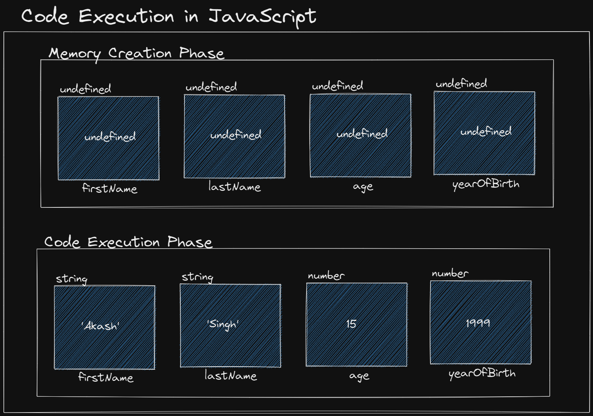

Originally JS was made for Netscape browser.

Originally JS was called "Mocha" then called "LiveScript" and finally called "JavaScript".

JS was made by "Brendan Eich"

Netscape made by Mark Andreessen

ECMA - European Computers Manufacturing Association (organisation that makes laws related to computers).

ECMAScript - Works like JS only but it is made up of things standardised by ECMA.

ECMAScript was inspired by JavaScript and is the standardised version of JavaScript. It is today used in almost all web browsers.

Versions of ECMAScript:

- ES1
- ES2
- ES3
- ES4
- ES5
- ES6
- ES7.....

Chrome came in 2008 and made V8 Engine for JavaScript.

Firefox engine for JS - Spider Monkey

Ryan Dahl took out the V8 Engine out of Chrome and put it in node.js (he created it), this enabled us to run JS in computers and servers (which are out of browsers).

JS was an `interpreted language` earlier. After the V8 engine, it became a `mixture of interpreted and compiled language`.

---

Introduction to JavaScript | The Complete JavaScript Course | Ep.02

JavaScript console is called REPL (Read Eval (Evaluate) Print Loop)

In basically means read our code, evaluate it (calculate it), print it and then loop back to the original position (starting position).

In JS, the BODMAS rule is not applied (here \* and / are given equal importance and whichever comes first is given more importance).

Same with + and -

We can run JS directly inside script tag, but it is normally not preferred. Write it inside script.js file.

---

Data Types in JavaScript | Primitive Data Types Explained | The Complete JavaScript Course | Ep.03

In JS 3, 3.56 etc. all are of datatype numbers

Using quotes inside string:

- single quotes inside double quotes

"Hi I am 'KSD' . Howdy"

- Double quotes inside single quotes
  'Hi I am "Anu Malik". Howdy'

`` also supports string

`` advantage -> It can support input of multiple lines of strings ("" and '' donot support this and give error).

eg.

`Hi
Nice to meet 
you` => Fine

"Hi
Nice to meet
you" => Error

'Hi
Nice to meet
you' => Error

`Template literals` -> using `` to input strings in multiple lines

[docs](https://developer.mozilla.org/en-US/docs/Web/JavaScript/Reference/Template_literals)

---

String to int conversions:

```js
typeof 100;
("number");

typeof "100";
("string");

typeof +"100";
("number");

typeof +`K456SD`;
("NaN"); // => Not a Number as KSD when converted to a number does not fall under any number, hence it was assigned NaN
// 🛑🛑🛑 This NaN is of type Number only (it is an invalid number)
```

🛑🛑 Better Way => Use 'parseInt()'

---

Int to string conversions

`100 + '' => '100'` or `'' + 100`

eg.

`100 + 'avb' => '100avb'` or `'jb' + 100 => 'jb100'`

---

+false => 0

+true => 1

+null => 0 (null is like false (0))

+undefined => NaN

parseInt(undefined)
NaN

parseInt(null)
NaN

BigInt:
https://www.w3schools.com/js/js_bigint.asp
https://developer.mozilla.org/en-US/docs/Web/JavaScript/Reference/Global_Objects/BigInt

---

# JS Variables, var, let, const ep, 04

helloJiMaa -> Camel case
hello_ji_maa -> Snake case
hello-ji-maa -> Kebab Case
HelloJiMaa -> Pascal Case

When we define a variable initially in JavaScript, javascript assigns it a type of 'undefined' by default.

const variables must be initialized as it cannot be updated later on.

🛑🛑🛑 INTERVIEW QUESTION:

var vs let differences ??

1. `let` and `const` are variables inside a block scope { (these variable values cannot be accessed outside of the block, if they are initialized inside the block) }.

1. `var` variables can however be done so, but it causes issues so we donot use var much often nowadays because of its global scopic nature.

1. We can access a variable declared with var before it is even initialized, eg. if we do:

```js
console.log(name);

var name = "ksd";

// Output is undefined but it will not give any error
```

2. But if we try to do the same thing with let and const, we will get a 'Not-defined' error:

```js
console.log(name)

let(or const) name = 'ksd'

// This will give us a not-defined error
```

🛑🛑 Remember, undefined is not an error, it is a datatype in javascript. Whereas not-defined is an error in javascript specifying that we are trying to access a variable that is not defined.

Naming variables in JS:

- only use A-Z or a-z
- use 0-9 (not start with digits)
- Special Chars (only \_ and $ are allowed)

Also we can use any language to name variables like hindi, kannada, bengali etc.. (with same rules above)

---

# Watch Your Code Running Line by Line in Dev Tools | The Complete JavaScript Course | Ep.05

The flow of program running in JavaScript happens in 2 ways:

1. Memory Creation Phase - In this phase, we see that the code is not executed but each variable creates a memory block of datatype `undefined` and inside it inserts values of `undefined`. All the steps like console log or any code execution steps are skipped.

2. Code Execution Phase - In this phase, we see that all the undefined values inserted inside the memory in step 1, gets replaced by the datatype values initialised in the code.

eg. let name = 'ajay';

step 1 => A memory block of undefined type is created and inside it, we give a value of undefined.

step 2 => The value undefined is replaced by 'ajay'



---

🛑 Why do we use defer after src in script tag in head.

We use defer with src in script tag in head because it gives us an edge when the network connection is slow.

Normal Cases:

loads title, loads script, loads body html

Defer Case:

loads title, calls script tag (simultaneously loads it with html) and loads body html.

This way when network is slow, we donot need to wait for the scipt tag to load after the html is done loading. (It is loaded beforehand and immediately starts working after loading of html body).

Defer Case:

```html
<!DOCTYPE html>
<html lang="en">
  <head>
    <meta charset="UTF-8" />
    <meta http-equiv="X-UA-Compatible" content="IE=edge" />
    <meta name="viewport" content="width=device-width, initial-scale=1.0" />
    <title>Code Execution in JavaScript</title>
    <script src="script.js" defer></script>
  </head>
  <body style="font-family: cursive">
    <h1>Code Execution in JavaScript</h1>
  </body>
</html>
```

Normal Case:

```html
<!DOCTYPE html>
<html lang="en">
  <head>
    <meta charset="UTF-8" />
    <meta http-equiv="X-UA-Compatible" content="IE=edge" />
    <meta name="viewport" content="width=device-width, initial-scale=1.0" />
    <title>Code Execution in JavaScript</title>
  </head>
  <body style="font-family: cursive">
    <h1>Code Execution in JavaScript</h1>
    <script src="script.js"></script>
  </body>
</html>
```

Debugging in JS

```js
debugger;
console.log(firstName); // code stops at this line

var firstName = "Akash";
let lastName = "Singh";
let age = 15;
const yearOfBirth = 1999;

// let userIntro = 'Hi, my name is ' + firstName + ' ' + lastName
```

## Temporal Dead Zone

The Temporal Dead Zone (TDZ) is a concept in JavaScript that relates to the hoisting of the variables and the visibility of variables declared with let and const. In the TDZ, a variable exists but it cannot be accessed until it is not declared. This prevents the variable from being used or accessed before a value is assigned to it.

eg. In the memory creation phase, we give the blocks the values of `undefined`.

This is only related to let and const.

---

Dialog Boxes in JavaScript | Alert, Confirm, & Prompt | The Complete JavaScript Course | Ep.06

There are 3 types of dialog boxes:

- alert('message')
  (gives only ok button. Ok -> undefined)
- confirm('message')
  (gives ok and cancel button. OK -> True, Cancel -> False)
- prompt('message')
  (works like alert but gives us an input field and an OK and cancel button returns the input value as the result).

This dialog box works in a particular tab in a particular browser. Different tabs have different environments in a browser.

---

[Template Literals | String Methods & Properties | The Complete JavaScript Course | Ep.07](https://www.youtube.com/watch?v=Z4x2EgRkJ1g&list=PLfEr2kn3s-br9ZFmejfLhAgMbGgbpdof8&index=53)

String Methods and Properties
Before starting string methods and properties we need know that strings are indexed. So basically we can access any single character of a string by doing something like this.

Indexing starts from 0.

Expression: 'Hello World'[1]

Result: 'e'

If we entered, 'Hello World[28] then result would have been 'undefined' as there is no char at position 28.

There is only one property that exists.

Property

- length

Methods (Without Argument)

- .toUpperCase()
- .toLowerCase()
- .trim() (Removes all the extra space from start and end)
- .trimStart() (Removes all the extra space from start)
- trimEnd() (Removes all the extra space from end)

Methods (With Argument)

- includes() (is the argument string present inside the main string)
- indexOf() (gives index of the argument char in the main string)
- replace() (replace (first) string part (argument) with another string (also in argument))
- replaceAll() (replace (all) string part (argument) with another string (also in argument))
- concat() (combines 2 strings, this can also be used with + sign)
- padStart() (used for masking with chars at start)
- padEnd() (used for masking with chars at end)
- charAt() (Returns char at a certain index) (same as char[3])
- charCodeAt() (Returns Ascii value of a char at a certain index)
- split() (splits a main string into many substrings based on the argument value)

chaining (putting method after method):

```js
const faltu = "Gannu Bhai     Zinda  hai      ";
-> undefined

faltu.trim
-> trim() { [native code] }

faltu.trim()
-> 'Gannu Bhai     Zinda  hai'

faltu.trim().toLowerCase() // chaining lowercase to trim
-> 'gannu bhai     zinda  hai'

faltu.trim().toUpperCase()
-> 'GANNU BHAI     ZINDA  HAI'

faltu.includes('ai')
-> true // this is case sensitive and checks for each char including spaces and symbols from start to end

faltu.indexOf('Z')
-> 15
faltu.indexOf('i')
-> 9
faltu.indexOf('I')
-> -1 // char not found in main string

faltu.indexOf('ha')
-> 7 // ha starts from 7 (in Bhai)

const faltu = "Gannu Bhai     Zinda  hai      ";
-> undefined

faltu.replace('Bhai', 'Bhabhi')
-> 'Gannu Bhabhi     Zinda  hai      '

faltu.replace('Mummy', 'Bhabhi')
-> 'Gannu Bhai     Zinda  hai       '  // no change

const faltu = "Gannu Bhai     Zinda  hai      ";
-> undefined
faltu.replace('i', 'I')
-> 'Gannu BhaI     Zinda  hai      '
// Replaces only the first i

// to replace all i's use replaceAll
const faltu = "Gannu Bhai     Zinda  hai      ";
-> undefined

faltu.replaceAll('i', 'I')
-> 'Gannu BhaI     ZInda  haI      '
// Replaces only the first i

const faltu = "Gannu Bhai     Zinda  hai      ";
-> undefined

faltu + 'Right!!'
-> 'Gannu Bhai     Zinda  hai      Right!!'

faltu.concat('right')
-> 'Gannu Bhai     Zinda  hai      right'

// Concat multiple Strings
const faltu = "Gannu Bhai     Zinda  hai";
-> undefined

faltu.concat(', ' , 'right')
-> 'Gannu Bhai     Zinda  hai, right'

faltu.concat(', ' , 'right ', 'bruv')
-> 'Gannu Bhai     Zinda  hai, right bruv'

let lastFourDigits = '4567';
-> undefined

lastFourDigits.padStart(14, '*')
-> '**********4567'

let firstFourDigits = '4567';
-> undefined

lastFourDigits.padEnd(14, '/')
-> '4567//////////'
// 14 is the final string length, i.e. 14 + 10 /'s

let firstFourDigits = '4567';
-> undefined

firstFourDigits.charAt(2);
-> '6'

firstFourDigits.charCodeAt(2);
-> 54 // (Ascii of '6')

firstFourDigits.charCodeAt(); // default firstFourDigits[0]
-> 52 // (Ascii of '4')

const string = 'Hi there all okayish'
undefined
string.split('i')
(3) ['H', ' there all okay', 'sh'] // i vanishes and becomes the breaking point
```

see more methods in docs

---

`` -> Template Literals

```js
const name = 'Hari';
-> undefined

`Hi my name is ` + name
-> 'Hi my name is Hari'

`Hi my name is `.concat(name)
-> 'Hi my name is Hari'

`Hi my name is ${name}`
-> 'Hi my name is Hari'
// used template literals


const name = 'Hari';
-> undefined

`Hi my name is ${name.toUpperCase()}`
-> 'Hi my name is HARI'

`Hi my name is ${'$' + name.toUpperCase()}`
->'Hi my name is $HARI'

const amount = 4587;;
-> undefined

`Hi I have ₹${amount}`
-> 'Hi I have ₹4587'

`Hi I have $${amount}`
-> 'Hi I have $4587'
```

---

[Math Object in JavaScript | The Complete JavaScript Course | Ep.08](https://www.youtube.com/watch?v=H3-1EQW2evA&list=PLfEr2kn3s-br9ZFmejfLhAgMbGgbpdof8&index=49)

Operators:

- - (Addition Operator)
- - (Subtraction Operator)
- - (Multiplication Operator)
- / (Division Operator)
- % (Remainder Operator)
- ** (Exponential Operator) (eg. 5 ** 3 => 5 _ 5 _ 5 = 125)
  (came in ES7)

### Math Object in JavaScript

Properties on Math Object: (no brackets)

- Math.PI => 3.14.......
- Math.SQRT2 => 1.414.....
- Math.E => 2.7..... (Euler's Number)

Methods on Math Object: (Need brackets)

- Math.pow(25, 2) => 25 \* 25 => 125 (old way)
- Math.sqrt(25) => 5
- Math.floor(6.1245) => 6
- Math.floor(6.999999999999999999999999) => 7 (number too large to be 6)
- Math.floor(-6.1245) => -7
- Math.ceil(6.2145) => 7
- Math.ceil(3.999999999999999999) => 4
- Math.ceil(3.000000000000000000000000001) => 3
- Math.ceil(-3.54) => -3
- Math.round(2.5) => 3
- Math.round(2.15) => 2
- Math.round(2.815) => 3
- Math.round(4.49999999999999999) => 5
- Math.random() -> gives numbers from [0 to 1] (1 is non inclusive)
- Math.random() -> 0.01814084155878959
- Math.random() -> 0.39936340140630944
- Math.random() => 0.03222613532767116
- Math.random() => 0.6275536784164206
- Math.random() => 0.5038095900697319

// give numbers between 0 to 19

- Math.floor(Math.random() \* 20) // 20 is not included

// give numbers between 0 to 20

- Math.floor(Math.random() \* 21)

// give numbers between 10 to 20
10 + Math.floor(Math.random() _ 11)
basic formula `Math.floor(Math.random() _ (max - min + 1) + min);`

min -> 10
max -> 20
max - min + 1 -> 11

follow the flow: + min is the last thing to be added

---

Infinity and NaN

- 8 / 0
  => Infinity

- typeof (Infinity)
  => 'number'

- 0 / 0
  => NaN

- typeof (NaN)
  => 'number'

- -5 / 0
  => -Infinity

- -0 / 0
  => NaN

Area of a Rectangle

```js
const width = +prompt("Enter width");
// String input converted to int, via +prompt
const length = +prompt("Enter length");

width;
length;

const area = width * length;
area;
```

In console

```js
const width = +prompt("Enter width");
undefined;

const length = +prompt("Enter length");
undefined;

width;
4;

length;
5;

const area = width * length;
undefined;

area;
20;

// displaying area in webpage
document.write(`Rectangle Area: ${area}`); // ans => 20
// remove defer in html for this and place script tag at the bottom
```

---

# [Truthy and Falsy](https://www.youtube.com/watch?v=UPARgGhfb5E&list=PLfEr2kn3s-br9ZFmejfLhAgMbGgbpdof8)

Which values are false in JS:

Falsy values in JS

Numbers -> 0, -0 and NaN
Strings -> ''
undefined
null

check via: Boolean(values)

eg. `Boolean(0) -> false`

rest all are truthy (true in js)

We can use `!` (NOT operator) to convert from truthy to falsy and vice versa.

!0 -> true
!!0 -> false (!! = original number)

---

[Comparison Operators](https://www.youtube.com/watch?v=HVhD13U5Bh0&list=PLfEr2kn3s-br9ZFmejfLhAgMbGgbpdof8&index=51)

- `==` equal value
- `===` equal value and equal datatype (strict equality, we have to do explicit(manual) conversion to compare different data types) (use === more than ==)
- `!=` not equal value
- `!==` not equal value or not equal datatype
- `>` greater than
- `<` less than
- `>=` greater than or equal to
- `<=` less than or equal to

all of them give true / false

used mostly with numbers

---

'20' == 20 (true as it implicitly converts string '20' to 20)

'20' === 20 (false)

+'20' === 20 (true)
parseInt('20') === 20 (true)
24 > 27 (false)
24 < 27 (true)
24 >= 27 (false)
24 <= 27 (true)
25 >= 25 (true)
25 <= 25 (true)

🛑🛑 For comparing, first convert it to number manually then compare.

---

[Logical Operators in JavaScript | And, Or, Not, Operators | The Complete JavaScript Course | Ep.11](https://www.youtube.com/watch?v=hjSSoCRU_nc&list=PLfEr2kn3s-bo4LwlbyZugHPavhcdW8YMC&index=12)

Logical Operators:

- AND (&&)
- OR (||)
- NOT (!)

🛑🛑 Logical Operators always return truthy and falsy values and not true and false values.

so let us see some egs.

```js
0 && 2 => 0 (falsy) as 0 is falsy and 2 is truthy

0 || 2 => 2 (truthy) as 0 is falsy and 2 is truthy

'' && 'Hello' => '' (falsy)

'' || 'Hello' => 'Hello' (truthy)

// AND checks for falsy values and returns the first value if both are falsy, it returns the second value if both are truthy and returns the falsy value if one is truthy and the other is falsy.

// eg.
0 || '' => 0

'' || 0 => ''

// OR on the other hand checks for both values and returns the later value if both are falsy and the first value if both are truthy and the truthy value if one is truthy and other is falsy.

```

some more egs.

```js
0 && ''
0

'' || 0
0

'' && 0
''

11 || 5
11

'' || 5
5

'' || 0
0

'' || -0
-0

47 || 8
47

45 || NaN
45

14 && 5
5

77 && 4
4

77 && 1454
1454

'hi' && undefined
undefined

'hi' || null
'hi'

null || null
null

null ||  null
null

null &&  null
null

45 && NaN
NaN

'hi' && 1 + 3
4

'hi' || 1 + 3
'hi'

'jio' && console.log('Hi')
Output -> Hi
result -> undefined

'jio' || console.log('Hi')
result -> 'jio'

undefined || console.log('Hi')
Output -> Hi
result -> undefined
```

use `!` to make truthy to false and falsy to true.

eg. !0 -> true

!'ji' => false

!!0 => false
!!!0 -> true

---

[Decision Making in JavaScript Using IF Statement | The Complete JavaScript Course | Ep.12](https://www.youtube.com/watch?v=6-dv7UETgJg&list=PLfEr2kn3s-bo4LwlbyZugHPavhcdW8YMC&index=16)

Simple if-else program

```js
const userName = prompt("Please Enter your name");
const userAge = +prompt("Please Enter your age");
// converted age to a number
// better way:
// const userAge = parseInt(prompt("Please Enter your age"));

if (userAge >= 22 && userAge <= 60) {
  console.log(`${userName} is a Working Professional`);
} else {
  console.log(`${userName} is NOT a Working Professional`);
}

console.log(`His age is ${userAge}`);
```

One drawback of parseInt:
🛑 parseInt(null) = NaN (cannot convert null to a number)
🛑 +null = 0

Task

```js
const userName = prompt("Please Enter your name") || "Procodrr";
const userAge = parseInt(prompt("Please Enter your age")) || 22;

console.log(userName);
console.log(`Age is ${userAge}`);
```

---

[Optimize Decision Making Using Else If and Else | The Complete JavaScript Course | Ep.13](https://www.youtube.com/watch?v=7lld3Xk5usQ&list=PLfEr2kn3s-bo4LwlbyZugHPavhcdW8YMC&index=14)

Some more examples

```js
const userName = prompt("Please Enter your name");
const userAge = parseInt(prompt("Please Enter your age"));
const gender = prompt("Enter your gender");

if (userName == null) {
  console.log("Procodrr is my name");
} else {
  console.log(userName);
}

if (userAge == NaN) {
  console.log("Age is 22");
} else {
  console.log(`Age is ${userAge}`);
}

if (gender == "male") {
  console.log("He reads a mail");
} else if (gender == "female") {
  console.log("She reads a mail");
} else {
  console.log("They read a mail");
}
```

🛑🛑🛑 if and else if cases can also get executed if the values inside them are truthy

eg.

```js
if (12) {
  console.log("Hey boy");
  // This will run as 12 is truthy
}

if (0) {
  console.log("Hey girl");
  // This will NOT run as 0 is falsy
}

/*
Output
'Hey boy'
*/
```

---

[Switch Statement in JavaScript | Switch Case | The Complete JavaScript Course | Ep.15](https://www.youtube.com/watch?v=ebJVbq6BDFI&list=PLfEr2kn3s-bo4LwlbyZugHPavhcdW8YMC&index=17)

```js
const grade = "A";

// 🛑🛑🛑 If the initialized value matches with the case, then the code statement inside the case will be executed.

// case can be ANYTHING and in any order

switch (grade.toLocaleLowerCase()) {
  // 'A' -> 'a'

  case "a":
    // 🛑 value matches with case, hence execute the code for this case
    console.log("Your score is between 85% to 100%.");
    break;
  case 1:
    // No match
    console.log("Your score is between 75% to 85%");
    break;
  case "c":
    // no match
    console.log("Your score is between 60% to 75%");
    break;
  case false:
    // no match
    console.log("Your score is between 50% to 60%");
    break;
  case "e":
    // no match
    console.log("Your score is between 30% to 50%");
    break;
  default:
    // match already found, so no need to execute the default code
    console.log("Sorry, you failed.");
}

console.log("Program Ended!");

// For case checking, it uses strict equality === (both values and datatypes)
// so 1 === '1' will be false in switch
```

### Switch case with multiple conditions to check:

```js
const username = "KSD";
const userAge = 24;

// 🛑🛑 Here since there are multiple conditions to match, we can just use true to go inside the switch statement code and then check the case there.

// 🛑 Because in normal cases, the case code will run when both conditions inside the case are true
switch (true) {
  case userAge >= 0 && userAge <= 4:
    // we can either use () or not. It is optional here. Using {} is also optional here.
    // case conditions are false
    console.log(`${username} is a kid.`);
    break;
  case userAge >= 5 && userAge <= 17:
    // case conditions are false

    console.log(`${username} is a school student.`);
    break;
  case userAge >= 18 && userAge <= 24:
    // case conditions are true, hence code of this case executes

    console.log(`${username} is a college student.`);
    break;
  // Break out of switch now. Fuck the other cases below
  case true:
    console.log(`${username} is a working professional.`);
    break;
  // case can be anything
  case userAge > 45 && userAge < 121:
    console.log(`${username} is retired.`);
    break;
  default:
    console.log("Please Enter a Valid Age");
}
```

🛑🛑 Now if two or more cases are same, then the topmost case will be executed as code executes from top to bottom, goes to that case, executes that code and then breaks out of the switch loop

---

Here is the same code via if-else

```js
const username = "KSD";
const userAge = 24;

if (userAge >= 0 && userAge <= 4) {
  console.log(`${username} is a kid.`);
  console.log("And he/she is playing.");
} else if (userAge >= 5 && userAge <= 17) {
  console.log(`${username} is a school student.`);
  console.log("And he/she is learning science and maths.");
} else if (userAge >= 18 && userAge <= 24) {
  console.log(`${username} is a college student.`);
  console.log("And he/she is learning computer science.");
} else if (userAge >= 25 && userAge <= 45) {
  console.log(`${username} is a working professional.`);
  console.log("And he/she is a web developer.");
} else if (userAge > 45 && userAge < 121) {
  console.log(`${username} is retired.`);
  console.log("And he/she reads newspaper.");
} else if (userAge >= 121) {
  console.log(`${username} is immortal.`);
  console.log("And he/she reads newspaper.");
} else {
  console.log("Please Enter a Valid Age");
}
```

---

```js
// Basic Ternary Operator Example
const username = 5 > 2 ? "KSD" : "Procodrr";
// here 5 > 2 is true so we will get 'KSD' as output.

const gender = "F";

// debugger
const userMessage = `${
  gender.toLocaleLowerCase() === "f" ? "She" : "He"
} is a college student.`;
// Here we used toLocaleLowerCase to make 'F' and 'f' same as both can work as female gender.

// Also we used template literals here to mix String with JS. See the use of `` in outer cases and '' inside the js logic to insert strings

// console.log(userMessage);
```

Using truthy and falsy with ternary operator

```js
const userMessage = `${12 ? "He" : "She"} is a person.`;

// here 12 is a truthy hence we get 'He is a person.' as output

const userMessage2 = `${null ? "He" : "She"} is a person.`;

// here null is a falsy hence we get 'She is a person.' as output
```

Chaining in ternary operators

```js
const result = null ? "Anurag" : "" ? "12" : 0;

console.log(result);

// Here null is falsy so this -> ('' ? '12' : 0) statement is executed. Now first it will check if '' is truthy or falsy, since '' is falsy, then we get 0 as the final output displayed in the console
```

Another example (from mdn)

```js
const result = () => {
  condition1 ? value1 : condition2 ? value2 : condition3 ? value3 : value4;
};

// this code if written in if-else format

const result = () => {
  if (condition1) {
    return value1;
  } else if (condition2) {
    return value2;
  } else if (condition3) {
    return value3;
  } else {
    return value4;
  }
};
```

This is pretty advance so look closely!!!

---

[How to See Variable Address in Dev Tools? | Memory Location | The Complete JavaScript Course | Ep.17](https://www.youtube.com/watch?v=Gqlv6inCZqI&list=PLfEr2kn3s-bo4LwlbyZugHPavhcdW8YMC&index=18)


In JS variables are created differently (we store undefined value in each variable) and and their values and addresses are stored differently, this is the first ORIGINAL step of memory creation.

In second step, we join the variable block (blue) and address-value block (red). This is the second step of JS -> Code Execution.

See address in memory tab in dev tools (use ctrl + f to get search bar, type akash, locate its address (starts with @), then type this address in search bar and then finally see all variables address there in the search execution context option).

```js
const firstName = 'Akash'
const lastName = 'Singh'
const userAge = 15
const birthYear = 2000
const isGraduate = false
const hasJob = true
```

Variables having similar values are stored in same addresses 
(eg. 
```js
const firstName = 'Akash'; 
const lastName = 'Akash';
// both will have same addresses
```
).

(eg2. 
```js
const firstName = 'Akash'; 
const lastName = 'Aka' + 'sh';
// both will have different addresses, though both will give same output but the way of creating them is different
```
).

Falsy values all have fixed addresses in the dev tools

eg.

false -> @75
true -> @73
null -> @71
undefined -> @67
'' -> @77

This may differ in different machines,

If we use let and var to re-assign the values, the addresses will also change, for that we need to take the snip again in memory to see the updated address changes.

## Do JS have pointers?

JavaScript does not have pointers in the same way languages like C or C++ do. However, JavaScript handles references to objects and arrays in a way that is conceptually similar to pointers. Here are some key points:

References vs. Pointers: In JavaScript, variables that store objects or arrays do not hold the actual object or array data but rather a reference to it. This is similar to how pointers work in other languages, but without direct memory address manipulation.

No Direct Memory Access: JavaScript does not allow direct manipulation of memory addresses. You cannot perform pointer arithmetic or access memory locations directly.

Object and Array References: When you assign an object or an array to a variable, the variable holds a reference to the actual object or array in memory. If you assign this variable to another variable, both variables will reference the same object or array.

```javascript
let obj1 = { name: "Alice" };
let obj2 = obj1; // obj2 references the same object as obj1
obj2.name = "Bob";
console.log(obj1.name); // Outputs "Bob"
```

Primitive Values: For primitive values (such as numbers, strings, and booleans), JavaScript handles them directly rather than through references.

Overall, while JavaScript manages references to objects and arrays in a way that shares some conceptual similarities with pointers, it abstracts away direct memory management and manipulation, providing a higher-level, safer environment for developers.

---

(JS Part 1 Over)