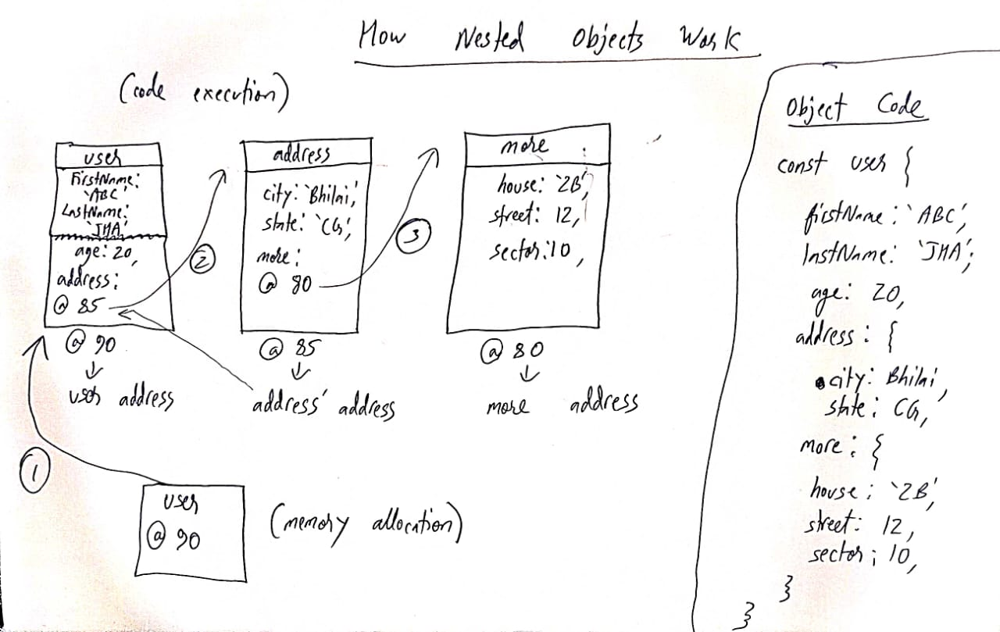

# [Objects in JavaScript Explained in Depth | The Complete JavaScript Course | Ep.18](https://www.youtube.com/watch?v=1Rhdtq5pYoY&list=PLfEr2kn3s-bo4LwlbyZugHPavhcdW8YMC&index=19)

Data types in JS

1. Number
2. String
3. Boolean
4. Null
5. Undefined
6. BigInt
7. Symbol

- (all these are primitive)

8. Non Primitive Datatypes (Object)

Objects are further divided into 3 types:

- Object Literals
- Arrays
- Functions

We will study Object Literals here

```js
const user1 = {
  firstName: "Akash",
  lastName: "Singh",
  age: 22,
  graduated: true,
};

const user2 = {
  firstName: "Akash",
  lastName: "Singh",
  age: 22,
  graduated: true,
};
```

here `user1 === user2` will give `false` as here the address of both objects are different.

### In non primitive data types, they are compared wrt their addresses or reference. Here objects having same value will have different addresses.

### In case of primitive data types, if their values are same, their addresses will also be same.

```js
const user1 = "";
const user2 = "";

user1 === user2;
// this will be true
```

### Fetching Values from objects

1. Using `.` operator **(DOT NOTATION)**

eg.

```js
const userb = {
  firstName: "Akash",
  lastName: "Singh",
  age: 22,
  graduated: true,
};

console.log(userb.firstName);
//   Akash
```

2. Using `['key'] or ["key"]` **(Bracket Notation)**

```js
const userb = {
  firstName: "Akash",
  lastName: "Singh",
  age: 22,
  graduated: true,
};

console.log(userb["firstName"]);
//   console.log(userb["firstName"]); // Also works

//   Akash
```

Here we used `'key'` and not `key` because keys are strings internally in JS.

Normally we donot use '' while writing keys in objects, but when we use other chars, we need them.

eg. Some key syntax

helpMe ✅ (no '' needed)

help-me ❌

'help-me' ✅ ('' needed)

### (Also to access this, we need bracket notation as this is not possible with `.` notation)

### WE can also use JS variables and expressions with Bracket notation which was not possible with `.` notation

eg. Bracket Notation + Variables

```js
const myName = "KSD";

const userb = {
  firstName: "Akash",
  lastName: "Singh",
  age: 22,
  graduated: true,
  KSD: "Boy",
};

console.log(userb["KSD"]);
// Output Boy
// See key and variable value is same i.e. object
```

eg. Bracket Notation + Expressions

```js
const myName = "KSD";

const userb = {
  firstName: "Akash",
  lastName: "Singh",
  age: 22,
  graduated: true,
  KSD: "Boy",
};

// console.log(userb['last']);
// undefined

console.log(userb["last" + "Name"]);
// Output Singh
// Here last was nothing and returned undefined, but when we used + to combine it with Name, it became lastName which was a valid, key and it returned us 'Singh'
```

But mostly we use `.` as we keep our keys simple.

### Updating Objects

1. Using `.`

```js
const userb = {
  firstName: "Akash",
  lastName: "Singh",
  age: 22,
  graduated: true,
};

userb.gender = "male";

console.log(userb);
```

2. Using `[]`

```js
const userb = {
  firstName: "Akash",
  lastName: "Singh",
  age: 22,
  graduated: true,
};

userb["gender"] = "female";

console.log(userb);
```

## Objects inside objects (Nested Objects)

```js
const details = {
  firstName: "Akash",
  lastName: "Singh",
  age: 22,
  graduated: true,
  address: {
    address1: {
      "house-number": "2B",
      street: 12,
    },

    address2: {
      sector: 10,
      city: "Bhilai",
      state: "CG",
    },
    phone: 8660421574,
  },
};

console.log(details);
```



Here is the internal working of nested objects.

Whenever a new object is created, a new address is allocated to it and we just pass its address in the parent object, as shown in the figure.

To make it easy to understand, for primitive data types like strings, we have passed its value directly (but it also internally refers to the address location of a string).

Nested Layout

- user object
  - address object
    - more object

#### Let us update the memory object

```js
const user = {
  firstName: "KSD",
  lastName: "JHA",
  age: 20,
  address: {
    city: "Bhilai",
    state: "CG",
    more: {
      house: "1B",
      street: 12,
      sector: 10,
    },
  },
};

(user.address.more.phoneNumber = 123456789),
  // adding a phone number in more object

  console.log(user.address.more.phoneNumber);
// Output : 123456789
```

---

[Object.freeze( ) vs Object.seal( ) in JavaScript | The Complete JavaScript Course | Ep.19](https://www.youtube.com/watch?v=K2v08vu-tK0&list=PLfEr2kn3s-bo4LwlbyZugHPavhcdW8YMC&index=20)

### Initialy, Address value ka hota hai, variable ka nahi. And then hum log uss address ko variable ko de dete hai.

### So when a variable is updated (variable value updated using let or var), then actually the address of that variable is changed as the value is related to address and then the variable then points to this new address (giving us the updated value).

🛑🛑🛑🛑🛑🛑  
eg.

```js
let username = "KSD"; // address is say @20
// variable username points to @20

username = "Saksham"; // address is now say @10
// variable username points to @10

console.log(username); // we get the value inside address @10 as variable username is pointing to @10. Hence we get output 'Saksham'.
```

### Deleting things from objects

Using the `delete` keyword, we are able to do so.

```js
const user = {
  firstName: "KSD",
  lastName: "JHA",
  age: 20,
  address: {
    city: "Bhilai",
    state: "CG",
    more: {
      house: "1B",
      street: 12,
      sector: 10,
    },
  },
};

delete user.address.more.house;
```

## Object.freeze() and Object.seal()

### Object.seal()

This is used when we want to prevent any new additions or deletions of key:value pair in objects.

But we can update the existing key:value pairs when using Object.seal().

### Object.freeze()

More advanced version, this will prevent us from adding & deleting new key:value pairs and also it will prevent us from even updating the existing key:value pairs.

| Properties | Object.Freeze() | Object.Seal() |
| ---------- | --------------- | ------------- |
| Adding     | ❌              | ❌            |
| Deleting   | ❌              | ❌            |
| Updating   | ❌              | ✅            |

eg.

```js
const user = {
  firstName: "KSD",
  lastName: "JHA",
  age: 20,
  address: {
    city: "Bhilai",
    state: "CG",
    more: {
      house: "1B",
      street: 12,
      sector: 10,
    },
  },
};

/* user
{firstName: 'KSD', lastName: 'JHA', age: 20, address: {…}}
address: city: "Bhilai"more: {house: '1B', street: 12, sector: 10}state: "CG"[[Prototype]]: Objectage: 20firstName: "KSD"lastName: "JHA"[[Prototype]]: Object
*/

// Objects.seal()
const user = {
  firstName: "KSD",
  lastName: "JHA",
  age: 20,
  address: {
    city: "Bhilai",
    state: "CG",
    more: {
      house: "1B",
      street: 12,
      sector: 10,
    },
  },
};
Object.seal(user);
user.gender = "male";
console.log(user.gender);
// trying to add

/*
user
{firstName: 'KSD', lastName: 'JHA', age: 20, address: {…}}
*/

// No change

// Trying to update
user.firstName = "MKL";

/*
user
{firstName: 'MKL', lastName: 'JHA', age: 20, address: {…}}
*/
// Update Successful

// Object.freeze()

// addition
const user = {
  firstName: "KSD",
  lastName: "JHA",
  age: 20,
  address: {
    city: "Bhilai",
    state: "CG",
    more: {
      house: "1B",
      street: 12,
      sector: 10,
    },
  },
};
Object.freeze(user);
user.gender = "male";
console.log(user.gender);

// updation
user.firstName = "MKL";
("MKL");

/*
{firstName: 'KSD', lastName: 'JHA', age: 20, address: {…}}
*/
// Addition failed
console.log(user.firstName);
KSD;

// Updation also failed
```

## `In` Keyword in objects

This returns a `bool` value indicating whether a key is present in an object or not.

#### See the below examples and clear all your doubts

eg.

```js
const user = {
  firstName: "KSD",
  lastName: "JHA",
  age: 20,
  address: {
    city: "Bhilai",
    state: "CG",
    more: {
      house: "1B",
      street: 12,
      sector: 10,
    },
  },
};

"firstName" in user;
// true

"hello" in user;
// false

"city" in user;
// false

"city" in address;
// VM15393:1 Uncaught ReferenceError: address is not defined
//     at <anonymous>:1:11
// (anonymous) @ VM15393:1Understand this error

"city" in user;
// false

"city" in user.address;
// true

"house" in user;
// false

"house" in address;
// VM15557:1 Uncaught ReferenceError: address is not defined
//     at <anonymous>:1:12
// (anonymous) @ VM15557:1Understand this error

"house" in user.address;
// false

"house" in user.address.more;
// true
```

---

# [Arrays Explained in Depth | The Complete JavaScript Course | Ep.20](https://www.youtube.com/watch?v=xerUjcKdA0o&list=PLfEr2kn3s-bo4LwlbyZugHPavhcdW8YMC&index=21)

Internally, arrays are objects only.

As arrays are a non-primitive data structure and object is the only non primitive data structure, hence arrays come under objects.

We keep objects of same datatype in an array.

See these egs

```js
["bob", "carl", "greg"];
// (3) ['bob', 'carl', 'greg']

typeof ["bob", "carl", "greg"];
// 'object'

const arr = ["bob", "carl", "greg"];
typeof arr;
// 'object'

typeof [];
// 'object'

typeof {};
// 'object'
```

Now if we use functions with arrays

eg

```js
[].concat()
typeof [].concat()
// 'object'

[].concat
// ƒ concat() { [native code] }

typeof [].concat
// 'function'
// This one should have been an object but it is a function here
```

Hence functions, arrays, and object literals can be treated in the same way as we treat objects.

### Accessing Array elements

```js
const arr = ["bob", "carl", "greg"];
arr[1];
// 'carl'
```

#### Accessing string Elements

```js
const str = "Williams";
// undefined

str[2];
("l");
```

### Updating Array elements

```js
const arr = ["bob", "carl", "greg"];
arr[1] = "Oscar";
arr[1];
// ['bob', 'Oscar', 'greg']
```

### We can change array values but we can not re-assign the array using const here.

### Adding / Inserting array elements now in the same array

```js
const arr = ["bob", "carl", "greg"];
arr[3] = "Oscar";
arr;
// (4) ['bob', 'carl', 'greg', 'Oscar']

arr.length;
// 4
```

#### We can also keep data of multiple data types in an array, but it is considered as a bad practice.

eg. Bad Practice

```js
const arr = ["bob", "carl", "greg", 4, true, null, undefined, {}];
arr;
// (8) ['bob', 'carl', 'greg', 4, true, null, undefined, {…}]

const arr_complex = [
  "bob",
  "carl",
  "greg",
  24,
  true,
  null,
  undefined,
  { name: "KSD", age: 23, address: { house: "22" } },
];
arr_complex;
/*(8) ['bob', 'carl', 'greg', 4, true, null, undefined, {…}]
0
: 
"bob"
1
: 
"carl"
2
: 
"greg"
3
: 
24
4
: 
true
5
: 
null
6
: 
undefined
7
: 
{name: 'KSD', age: 23, address: {…}}
length
: 
8
[[Prototype]]
: 
Array(0)
*/
```

### Note: Please do keep objects of same datatype in an array

### Doing some playing, inserting element at index 10 at an array of size 4

```js
const fruits = ["apple", "mango", "grapes", "papaya"];
// undefined

fruits[10];
// undefined

fruits[10] = "banana";
// 'banana'
fruits;
// (11) ['apple', 'mango', 'grapes', 'papaya', empty × 6, 'banana']
// zero based indexing
```

## Adding elements to the end of the array

- use `array[array.length] = element`
- use `array.push(element)`

## Removing elements to the end of the array

- use `array.pop()`

eg.

```js
const haru = ["Violet", "Indigo", "Blue", "Green", "Yellow"];
// undefined

haru[haru.length] = "Pink";
// 'Pink'

haru;
// (6) ['Violet', 'Indigo', 'Blue', 'Green', 'Yellow', 'Pink']

haru[haru.length] = "Black";
// 'Black'

haru;
// (7) ['Violet', 'Indigo', 'Blue', 'Green', 'Yellow', 'Pink', 'Black']

haru.push("white");
// 8 -> Array size

haru.push("grey");
// 9

haru;
// (9) ['Violet', 'Indigo', 'Blue', 'Green', 'Yellow', 'Pink', 'Black', 'white', 'grey']

haru.pop();
// 'grey'

haru;
// (8) ['Violet', 'Indigo', 'Blue', 'Green', 'Yellow', 'Pink', 'Black', 'white']

haru.pop();
// 'white'

haru.pop();
// 'Black'

haru;
// (6) ['Violet', 'Indigo', 'Blue', 'Green', 'Yellow', 'Pink']
```

Some more egs..

```js
haru;
// (6) ['Violet', 'Indigo', 'Blue', 'Green', 'Yellow', 'Pink']

haru.push("jklm", null, 22, true, undefined, 24.842);
// 12

haru;
// (12) ['Violet', 'Indigo', 'Blue', 'Green', 'Yellow', 'Pink', 'jklm', null, 22, true, undefined, 24.842]
```

## Key:Value Pair in array

Normally we cannot write elements in key value pairs while initializing an array, but we can write it indirectly

Though it is not a good practice to do so.

```js
// Direct Method Gives Error
const arr = [firstName: 'KSD']
// VM50773:1 Uncaught SyntaxError: Unexpected token ':'Understand this error

// Indirect Method (treating the array like an object literal)
const arr = []
// undefined

arr.firstName = 'KSD';
// 'KSD'

arr
/* [firstName: 'KSD']
firstName: "KSD"
length: 0 // 🛑🛑 length is the same as the empty array, it will not get updated
[[Prototype]]: Array(0)
*/
arr.firstName
// 'KSD'

// THIS WORKS!!
```

---

# [Most Common Array Methods in JavaScript | The Complete JavaScript Course | Ep.21](https://www.youtube.com/watch?v=RTfNjbqQokI&list=PLfEr2kn3s-bo4LwlbyZugHPavhcdW8YMC&index=24)

## Basic Array Methods

- push()
- pop()
- shift()
- unshift()
- concat()
- indexOf()
- includes()
- reverse()
- sort()
- slice()
- splice()

push and pop are already covered

shift() -> removes an element from the front

unshift() -> adds an element to the front

eg

```js
const numbers = [2, 4, 6, 8, 10];
// undefined

numbers.shift();
// 2

numbers;
// (4) [4, 6, 8, 10]

numbers.shift();
// 4

numbers;
// (3) [6, 8, 10]

numbers.unshift(-45);
// 4

numbers;
// (4) [-45, 6, 8, 10]

numbers.unshift(123);
// 5

numbers;
// (5) [123, -45, 6, 8, 10]
```

concat -> Adds 2 arrays

eg

```js
const numbers = [2, 4, 6, 8, 10];
// undefined

numbers.concat(["a", "b", "c", "d", "e"]);
// (10) [2, 4, 6, 8, 10, 'a', 'b', 'c', 'd', 'e']
```

### concat does not alter or change our old array values. It only updates them

eg2 Multiple Array Concatenation

```js
const numbers = [2, 4, 6, 8, 10];
// undefined

const odd = [1, 3, 5, 7, 9];
// undefined

const letters = ["a", "b", "c"];
// undefined

numbers.concat(odd, letters);
// (13) [2, 4, 6, 8, 10, 1, 3, 5, 7, 9, 'a', 'b', 'c']
```

indexOf -> Gives index of a particular array element

eg

```js
const words = ["apple", "ball", "color", "color", "dog"];
// undefined

words.indexOf("apple");
// 0

words.indexOf("ball");
// 1

words.indexOf("color");
// 2

words.indexOf("dog");
// 4

words.indexOf("cow");
// -1 ('cow' not found in the array)
```

#### If there are duplicate elements in the array then we get back the index of the first element while using indexOf().

#### Also this method is case sensitive i.e., 'Cat' & 'cat' are different entities for it.

includes -> This is a boolean method that tells us if an element is present inside of an array or not.

If it is present then we can get true else we get false.

example

```js
const words = ["apple", "ball", "color", "color", "dog"];
// undefined

words.includes("apple");
// true

words.includes("apples");
// false

words.includes("Apple");
// false

words.includes("pineapple");
// false
```

reverse -> Reverses all elements in the array

eg

```js
const words = ["apple", "ball", "color", "Color", "dog"];
// undefined

words.reverse();
// (5) ['dog', 'Color', 'color', 'ball', 'apple']
```

sort -> Sorts all the elements in ascending order in an array

```js
const words = ["apple", "ball", "color", "Color", "dog"];
// undefined

words.sort();
// (5) ['Color', 'apple', 'ball', 'color', 'dog']
```

### It gives priority to uppercase words then lowercase words as ASCII of uppercase letters is less, hence it gives priority to it while sorting it in ascending order.

### Sort and reverse modify the original array, they do not create a copy of the original array and then modify it.

eg. 2

```js
const words = ["apple", "ball", "color", "Color", "Dog"];
undefined;
words.sort()(5)[("Color", "Dog", "apple", "ball", "color")];
words(5)[("Color", "Dog", "apple", "ball", "color")];
```

eg2

```js
const words = ["apple", "ball", "color", "Color", "Dog"];
// undefined

words.sort();
// (5) ['Color', 'Dog', 'apple', 'ball', 'color']

words;
// (5) ['Color', 'Dog', 'apple', 'ball', 'color']
```

For now it is sorting only in alphabetical order. Be it a number or a string array, we will see sort again later.

slice -> This method `does not modify the original array`, rather it gives us a sliced version of an array

eg.

```js
const words = ["apple", "ball", "color", "Color", "Dog", "Neptune", "Megatron"];
// undefined

words;
// (7) ['apple', 'ball', 'color', 'Color', 'Dog', 'Neptune', 'Megatron']

words.slice(3);
// (4) ['Color', 'Dog', 'Neptune', 'Megatron']

words;
// (7) ['apple', 'ball', 'color', 'Color', 'Dog', 'Neptune', 'Megatron']

words.slice(3, 5);
// (2) ['Color', 'Dog']
```

### Here syntax is: `slice(start index, end index)`

## `But output is [start index element, end index - 1 element]`

splice -> `This method modifies the original array`

eg.

```js
const words = ["apple", "ball", "color", "Color", "Dog", "Neptune", "Megatron"];
// undefined

words.splice(2, 3);
// (3) ['color', 'Color', 'Dog']

words;
// (4) ['apple', 'ball', 'Neptune', 'Megatron']
```

Syntax: `splice(start index, length)`

We can also replace the elements using splice

Syntax: `splice(start index, length, replaced words in original array)`

eg

```js
const words = ["apple", "ball", "color", "Color", "Dog", "Neptune", "Megatron"];
// undefined

words.splice(2, 3, "abcd", "vbnm", "lkjh", "jkl");
// (3) ['color', 'Color', 'Dog']
// Removed from original array

words;
// (8) ['apple', 'ball', 'abcd', 'vbnm', 'lkjh', 'jkl', 'Neptune', 'Megatron']

// words added in original array
```

---

# [Multidimensional Arrays are Easier Than You Might Think | The Complete JavaScript Course | Ep.22](https://www.youtube.com/watch?v=hhO8aiDgN9A&list=PLfEr2kn3s-bo4LwlbyZugHPavhcdW8YMC&index=23)

Multidimensional Arrays => Arrays inside array

let us see an eg.

```js
const tictactoe = [
  ["X", null, null],
  [null, null, "O"],
  ["O", null, "X"],
];
// undefined

tictactoe;
// (3) [Array(3), Array(3), Array(3)]
/*
0
: 
(3) ['X', null, null]
1
: 
(3) [null, null, 'O']
2
: 
(3) ['O', null, 'X']
length
: 
3
[[Prototype]]
: 
Array(0)
*/
```

All properties are like arrays like accessing, updating, inserting, deleting etc.

Accessing

```js
const tictactoe = [
  ["X", null, null],
  [null, null, "O"],
  ["O", null, "X"],
];
// undefined

tictactoe[0][1];
// null

tictactoe[1][2];
// 'O'

tictactoe[2][0];
// 'O'

tictactoe[2];
// (3) ['O', null, 'X']

tictactoe[1];
// (3) [null, null, 'O']

tictactoe[0];
// (3) ['X', null, null]
```

inserting

```js
const tictactoe = [
  ["X", null, null],
  [null, null, "O"],
  ["O", null, "X"],
];
// undefined

tictactoe.push(["X", "X", "X"]);
// 4 (length)

tictactoe;
// (4) [Array(3), Array(3), Array(3), Array(3)]0: (3) ['X', null, null]1: (3) [null, null, 'O']2: (3) ['O', null, 'X']3: (3) ['X', 'X', 'X']length: 4[[Prototype]]: Array(0)

tictactoe[3];
// (3) ['X', 'X', 'X']
```

If we try to access anything outside of the array range, we get `undefined` as output.

---

# [Right Way to Copy Objects and Arrays | Deep Vs Shallow Copy | The Complete JavaScript Course | Ep.23](https://www.youtube.com/watch?v=l_YFa0SKqtY&t=754s)

Normally when we copy the array or object elements and make some changes in it. Eventually we end up altering the original array as well.

Let us see some examples:

Let us see some primitive datatype first (string example):

```js
const username1 = "KSD";
let username2 = username1;
username2 = username2 + " Shukla";

username2;
// 'KSD Shukla'
username1;
// 'KSD'
```

Here we could not copy the elements properly as upon updating, we get an entirely new variable username2 which has an entirely new address.

Now let us see some array examples:

```js
const fruits = ["Mango", "Apple", "Orange"];

const myFruits = fruits;

myFruits.push("Dates");
myFruits.push("Grapes");

myFruits;
// (5) ['Mango', 'Apple', 'Orange', 'Dates', 'Grapes']
fruits;
// (5) ['Mango', 'Apple', 'Orange', 'Dates', 'Grapes']
```

Here we pushed Dates and Grapes in myFruits so why is fruits array also updating.

This is because they are non primitive datatypes, and initially when fruits = myFruits, they share the same memory location address, so pushing dates and grapes in myFruits means pushing dates and grapes in the array memory which is shared by both fruits and myFruits. Hence we see both arrays getting updated because here we are not reassigning the array but rather we are updating the elements inside of it.

Same case happens with objects:

```js
const user1 = {
  fName: "Kaustubhya",
  lName: "Shukla",
};

const user2 = user1;

user2.lName = "Sharma";

user2.fName = "Rohit";

user2;
// {fName: 'Rohit', lName: 'Sharma'}

user1;
// {fName: 'Rohit', lName: 'Sharma'}
```

Here also just like arrays, upon updating user2, user1 is also getting affected and updated.

## Shallow Copying Methods for arrays and objects

### 1. Objects.assign()

Let us now see the correct way of copying objects:

```js
const user1 = {
  fName: "Manan",
  lName: "Das",
};

const user2 = {};

// now user 2 and user1 have different addresses as initially user2 is empty.

// Copy contents of user1 into user2
Object.assign(user2, user1);
// {fName: 'Manan', lName: 'Das'}

user1;
// {fName: 'Manan', lName: 'Das'}

user2;
// {fName: 'Manan', lName: 'Das'}

user2.fName = "Patrick";
// 'Patrick'

user2.lName = "Kumar";
// 'Kumar'

user2;
// {fName: 'Patrick', lName: 'Kumar'}

user1;
// {fName: 'Manan', lName: 'Das'}
```

Now it is copied correctly now. And original object is no longer getting affected.

Let us see in arrays now:

```js
const arr1 = [1, 3, 5, 7, 9];
// undefined

const arr2 = [];
// undefined

Object.assign(arr2, arr1);
// (5) [1, 3, 5, 7, 9]

arr2;
// (5) [1, 3, 5, 7, 9]

arr1;
// (5) [1, 3, 5, 7, 9]

arr2.push(99999);
// 6

arr2;
// (6) [1, 3, 5, 7, 9, 99999]

arr1;
// (5) [1, 3, 5, 7, 9]
```

### 2. The ... (spread) operator

Now no one uses Object.assign() no more, so we use the ... operator now

eg
Arrays

```js
const arr1 = [1, 3, 5, 7, 9];
// undefined

const arr2 = [...arr1];
// undefined

arr2;
// (5) [1, 3, 5, 7, 9]

arr1;
// (5) [1, 3, 5, 7, 9]

arr2.push(99999);
// 6

arr2;
// (6) [1, 3, 5, 7, 9, 99999]

arr1;
// (5) [1, 3, 5, 7, 9]
```

Objects example via the spread operator

```js
const user1 = {
  fName: "Kas",
  lName: "Shukla",
};
// undefined

const user2 = { ...user1 };
// undefined

user2;
// {fName: 'Kas', lName: 'Shukla'}

user1;
// {fName: 'Kas', lName: 'Shukla'}

user2.age = 20;
// 20

user1;
// {fName: 'Kas', lName: 'Shukla'}

user2;
// {fName: 'Kas', lName: 'Shukla', age: 20}
```

### 3. Using the .concat() method (for arrays only)

```js
const letters1 = ["ab", "abc", "bc"];
// undefined

const letters2 = [].concat(letters1);
// undefined

letters1;
// (3) ['ab', 'abc', 'bc']

letters2;
// (3) ['ab', 'abc', 'bc']

letters2.push("xse");
// 4

letters2;
// (4) ['ab', 'abc', 'bc', 'xse']

letters1;
// (3) ['ab', 'abc', 'bc']
```

### 3. Using the .slice() method (for arrays only)

We know that the slice method does not hamper the original array but rather it creates a copy of that array and then modifies it.

eg

```js
const letters1 = ["ab", "abc", "bc"];
// undefined

letters1;
// (3) ['ab', 'abc', 'bc']

const letters2 = letters1.slice();
// undefined

// 🛑🛑 Here we did not specify the starting and ending index in slice so it will copy the entire array from index 0 to index arr.length() - 1.

letters2;
// (3) ['ab', 'abc', 'bc']

letters2.push("haji");
// 4

letters2;
// (4) ['ab', 'abc', 'bc', 'haji']

letters1;
// (3) ['ab', 'abc', 'bc']
```

`Now these are Shallow copy methods that only work on normal arrays and objects.`

`But what if we have nested arrays and objects. In such cases, the shallow copy methods may work on the outer most objects/arrays but they fail to do so in the nested objects and arrays (inner objects/arrays).`

In such cases, we use deep copy

## Deep copy methods

### 1. Using JSON.stringify and JSON.parse

first make the non-primitive datatype to primitive using JSON.stringify, then make the changes and finally use JSON.parse to make the changed thing back to non-primitive

```js
const ingredientsList = ["noodles", { list: ["eggs", "flour", "water"] }];

const ingredientsListDeepCopy = JSON.parse(JSON.stringify(ingredientsList));

// Change the value of the 'list' property in ingredientsListDeepCopy.
ingredientsListDeepCopy[1].list = ["rice flour", "water"];
// Meaning -> The whole thing is an array, so go to index 1 of the array, that is an object, go to the list key and update its values

// The 'list' property does not change in ingredients_list.
console.log(ingredientsList[1].list);
// Array(3) [ "eggs", "flour", "water" ]
// (3) ['eggs', 'flour', 'water']

ingredientsList;
/*
(2) ['noodles', {…}]
0
: 
"noodles"
1
: 
list
: 
(3) ['eggs', 'flour', 'water']
[[Prototype]]
: 
Object
length
: 
2
[[Prototype]]
: 
Array(0)
*/

ingredientsListDeepCopy;
/*
(2) ['noodles', {…}]
0
: 
"noodles"
1
: 
list
: 
(2) ['rice flour', 'water']
[[Prototype]]
: 
Object
length
: 
2
[[Prototype]]
: 
Array(0)
*/
```

# [Combined Assignment Operators in JS | Increment and Decrement Operator | Ep.24](https://www.youtube.com/watch?v=AnVdRB2n7kg&list=PLfEr2kn3s-bo4LwlbyZugHPavhcdW8YMC&index=27)

There are the following types of combined assignment operators:

| Operator | Type                               |
| -------- | ---------------------------------- |
| +=       | Addition Assignment Operator       |
| -=       | Subtraction Assignment Operator    |
| \*=      | Multiplication Assignment Operator |
| /=       | Division Assignment Operator       |
| %=       | Remainder Assignment Operator      |
| \*\*=    | Exponentiation Assignment Operator |

- Increment++
- Decrement--

eg

```js
let num = 5;
// using let as num will be updated

num **= 2;
// num = num ** 2
// 5 ** 2 = 25
```

```js
let num = 10;
num += 5;
// num = num + 5
// 10 + 5 = 15
num += 5; // 15 + 5 = 20
num += 5; // 20 + 5 = 25
num += 5; // 25 + 5 = 30
```

### `++` & `--`

```js
let num = 10;
num++;
// num = num + 1;
// num = 10 + 1 = 11
```

```js
let num = 10;
num--;
// num = num - 1;
// num = 10 - 1 = 9
```

`++num` vs `num++`

`++num` (Pre Increment Operator)

Increment first then print result value

`num++` (Post Increment Operator)

Print result value first then increment the variable

eg. ++num

```js
let num = 5;
// undefined

++num;
// 6 (increment)

num;
// 6 (print)
```

```js
let num = 5;
// undefined

num++;
// 5 (print)

num;
// 6 (increment)
```

`We cannot use const with these`

`Address also changes here`

# [While Loop in JavaScript | Explained in Depth | The Complete JavaScript Course | Ep.25](https://www.youtube.com/watch?v=IoDfreDgTgM&list=PLfEr2kn3s-bo4LwlbyZugHPavhcdW8YMC&index=26)

### Printing numbers from 1 to 100

```js
let num = 1;
while (num < 101) {
  console.log(num);
  num++;
}
```

### Printing Elements of an array

```js
const friends = ["ajay", "pinku", "lov", "kadr"];
let i = 0;
while (i < friends.length) {
  console.log(friends[i]);
  i++;
}
```

### Adding some serial Numbers

```js
const friends = ["ajay", "pinku", "lov", "kadr"];
let i = 0;
undefined;
while (i < friends.length) {
  console.log(`${i + 1}. ${friends[i]}`);
  i++;
}
//  1. ajay
//  2. pinku
//  3. lov
//  4. kadr
```

### Updating the array using loops

```js
const friends = ['ajay', 'pinku', 'lov', 'kadr']
let i = 0;
while(i < friends.length){
    console.log(`${i + 1}. ${friends[i]}`);
    friends[i] += ' Procodrr'
    i++;
}
 1. ajay
 2. pinku
 3. lov
 4. kadr
// 3
friends
// (4) ['ajay Procodrr', 'pinku Procodrr', 'lov Procodrr', 'kadr Procodrr']
```

# [For Loop in JavaScript | The Complete JavaScript Course | Ep.26](https://www.youtube.com/watch?v=jsttBfsjIWc&list=PLfEr2kn3s-bo4LwlbyZugHPavhcdW8YMC&index=27)

eg1 Printing Array Elements

```js
const friends = ["ajay", "pinku", "lov", "kadr"];
for (let i = 0; i < friends.length; i++) {
  console.log(friends[i]);
}
//  ajay
//  pinku
//  lov
//  kadr
```

```js
for (let i = 0; i < 5; i++) {
  console.log(i);
}

/*
0
1
2
3
4
*/
```

eg3

```js
const friends = ["ajay", "pinku", "lov", "kadr"];
for (let i = 0; i < friends.length; i++) {
  console.log(friends[i]);
  friends[i] += " Pro";
}

//  ajay
//  pinku
//  lov
//  kadr

friends;
// (4) ['ajay Pro', 'pinku Pro', 'lov Pro', 'kadr Pro']
```

## Printing even numbers from 0 to 100

```js
for (let i = 0; i <= 100; i = i + 2) {
  console.log(i);
}
```

---

# [Do While Loop in JavaScript | The Complete JavaScript Course | Ep.27](https://www.youtube.com/watch?v=XSevUMHPC3o&list=PLfEr2kn3s-bo4LwlbyZugHPavhcdW8YMC&index=28)

This loop runs at-least once even if the condition is false.

eg false condition

```js
let i = 10;

do {
  console.log(i);
  i++;
} while (i < 5);
```

eg true condition

```js
let i = 1;

do {
  console.log(i);
  i++;
} while (i < 5);
```

### In for loop, 'i' is declared in local (block) scope and it is not available in the global scope in the outer program.

### In while and do-while, 'i' is declared in global scope so we can access 'i' also in the outer program.

#### It is better to have less memory in the global scope. So for is better here.

## Rest and Spread Operators in JS

The rest and spread operators in JavaScript are both represented by three consecutive dots (...). They are used to work with arrays and objects in a more flexible and concise way.

### Spread Operator

The spread operator allows an iterable (like an array or a string) to be expanded in places where zero or more arguments (for function calls) or elements (for array literals) or key-value pairs (for object literals) are expected.

Examples:
Array Literals:

```javascript
const arr1 = [1, 2, 3];
const arr2 = [...arr1, 4, 5, 6];
console.log(arr2); // [1, 2, 3, 4, 5, 6]
```

Function Calls:

```javascript
const numbers = [1, 2, 3];
const add = (a, b, c) => a + b + c;
console.log(add(...numbers)); // 6
```

Object Literals:

```javascript
const obj1 = { a: 1, b: 2 };
const obj2 = { ...obj1, c: 3 };
console.log(obj2); // { a: 1, b: 2, c: 3 }
```

## Rest Operator

The rest operator allows us to represent an indefinite number of arguments as an array. It is used in function parameter lists to gather all remaining arguments into an array.

Examples:
Function Parameters:

```javascript
function sum(...args) {
  return args.reduce((acc, val) => acc + val, 0);
}

console.log(sum(1, 2, 3, 4)); // 10
```

Array Destructuring:

```javascript
const [first, ...rest] = [1, 2, 3, 4];
console.log(first); // 1
console.log(rest); // [2, 3, 4]
```

Object Destructuring:

```javascript
const { a, b, ...rest } = { a: 1, b: 2, c: 3, d: 4 };
console.log(a); // 1
console.log(b); // 2
console.log(rest); // { c: 3, d: 4 }
```

Key Differences

#### Spread Operator:

- Used to spread elements/values.
- Can be used with arrays, function calls, and object literals.

Syntax: [...iterable], fn(...args), {...object}.

#### Rest Operator:

- Used to collect elements/values.
- Used in function parameters and destructuring assignments.

Syntax: function(...args), let [...rest] = array, let {...rest} = object.

Both operators enhance the capabilities of JavaScript for handling arrays and objects, making code more concise and readable.


# Interview Q: Random Password Generator
## Write JavaScript code that generates a random password of length 8 consisting of uppercase letters, lowercase letters, and numbers. (Hint: You can use the Math.random() function to generate random numbers and convert them to characters.)

```js
let characters = 'ABCDEFGHIJKLMNOPQRSTUVWXYZabcdefghijklmnopqrstuvwxyz0123456789';

let password = "";

for(let i = 0; i < 8; i++) {
    let random = Math.floor(Math.random() * characters.length);
    password += characters[random];
}

console.log(password)
```

### Flow 
1. We made a character string of all possible characters
2. Next we initialised a password string (which is initially empty)
3. Then we ran a loop from 0 to 7 to include 8 characters
4. Next we generated a random string of length characters.length and used floor to remove the decimal
5. Next we updated password via password = password + characters[random]

i.e. each time it will pick one index (which will be random) and then it will add the element of that index to password string. This will go on till we reach 8 chars

---

# [Introduction to Functions | The Complete JavaScript Course | Ep.28](https://www.youtube.com/watch?v=htufr8nVeu4&list=PLfEr2kn3s-bo4LwlbyZugHPavhcdW8YMC&index=29)

Functions are re-usable piece of code that we can use over and over again.

### Each function does 2 things

1. Give us the output i.e. prints the output
2. Returns a value

eg.

```js
function greeting() {
  console.log("Hello");
  console.log("I am KSD");
  console.log("Nice to meet you");
}

greeting();

// Printed value of the function
/*
Hello
I am KSD
Nice to meet you
*/

// Return type of the function
// undefined
```

eg2

```js
// Function Definition
function greeting() {
  console.log("Hello");
  console.log("I am KSD");
  console.log("Nice to meet you");

  return "Function Over";
}

// Function Call (stored in a variable)
const functionCall = greeting();

greeting();

/*
Hello
I am KSD
Nice to meet you

return value ↓
'Function Over'
*/

functionCall; // gives us the function return value
// 'Function Over'
```

## Arguments and Parameters

```js
function greeting(name) {
  console.log(`Hello My name is ${name}. Nice to meet you`);
}

greeting();
greeting("Kathua");

// Hello My name is undefined. Nice to meet you
// Hello My name is Kathua. Nice to meet you
```

#### Here argument is the one used inside function call ('Kathua')

#### Parameter is the one used inside function definition (name)

#### P A -> Def. Call (tip to remember)

### Putting in the default parameter to replace `undefined`

```js
function greeting(name = "Kabir") {
  console.log(`Hello My name is ${name}. Nice to meet you`);
}

greeting();
greeting("Kathua");

// Hello My name is Kabir. Nice to meet you
// Hello My name is Kathua. Nice to meet you
```

### Before this default parameter

```js
function greeting(username) {
  if (!username) {
    username = "Kabir";
  }

  // 🛑🛑 username was initially falsy, so we used ! to make it truthy

  console.log(`Hello My name is ${username}. Nice to meet you`);
}

greeting();
greeting("Kathua");

/*
Hello My name is Kabir. Nice to meet you
Hello My name is Kathua. Nice to meet you

Works same
*/
```

#### Another way

```js
function greeting(username) {

    console.log(`Hello My name is ${username || 'Kabir'}. Nice to meet you`);
}

greeting()
greeting('Kathua')

/*
Hello My name is Kabir. Nice to meet you
Hello My name is Kathua. Nice to meet you

Works same
*/
```

Since we used `OR (||)`, it checks the first value `undefined`. As it is falsy, it checked the second condition which was truthy `('Kabir')` and hence returned that.

## Multi arguments

```js
function greeting(username, profession) {

    console.log(`Hello My name is ${username || 'Kabir'}. Nice to meet a ${profession || 'man'}`);
}

greeting()
greeting('Kathua', `Wrestler`);

/*
Hello My name is Kabir. Nice to meet a man
Hello My name is Kathua. Nice to meet a Wrestler
*/
```

#### Hover over to see

eg3

```js
function greeting(username, profession, age) {

    console.log(`Hello My name is ${username || 'Kabir'}. Nice to meet a ${profession || 'man'}. He is ${age} years old.`);
}

greeting()
greeting('Kathua', `Wrestler`, 25);
```

[Return Keyword in JavaScript Explained in Depth | The Complete JavaScript Course | Ep.29](https://www.youtube.com/watch?v=hz9Zpv36jAM&list=PLfEr2kn3s-bo4LwlbyZugHPavhcdW8YMC&index=30)

### Console log is not the return type of a function.

eg1 Add 2 nos.

```js
function sum(a, b) {
    return `Sum is ${a + b}`;
}

const sumResult = sum(5, 7);

console.log(sumResult)

// Sum is 12

```

eg2 Subtract 2 nos.

```js

function difference(a, b) {
    return `Result is ${a - b}`;
}

const result = difference(5, 7);

console.log(result)

// Result is -2
```

eg3 Calculation included in arguments

```js
function sum(a, b) {
    return `Sum is ${a + b}`;
}

const sumResult = sum(5+15, 7-5);

console.log(sumResult)

// Sum is 20 + 2 = 22
```

```js
function sum(a, b) {
    return a + b;
}

const sumResult = sum(sum(5, 15), sum(12, 5));

console.log(sumResult)

// sum(20, 17) => 37

// 🛑🛑 Donot include any strings here as it can cause string concatenation instead of arithmetic operation
```

---

