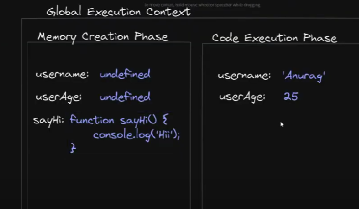
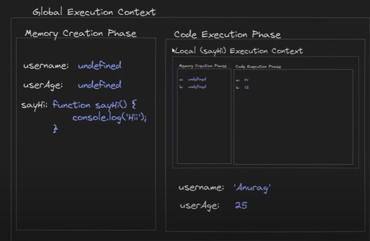
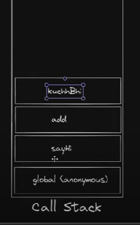
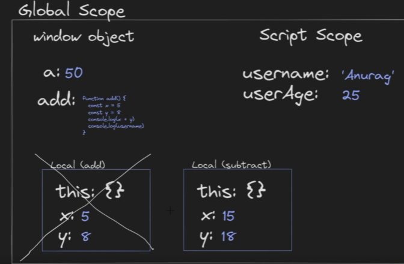
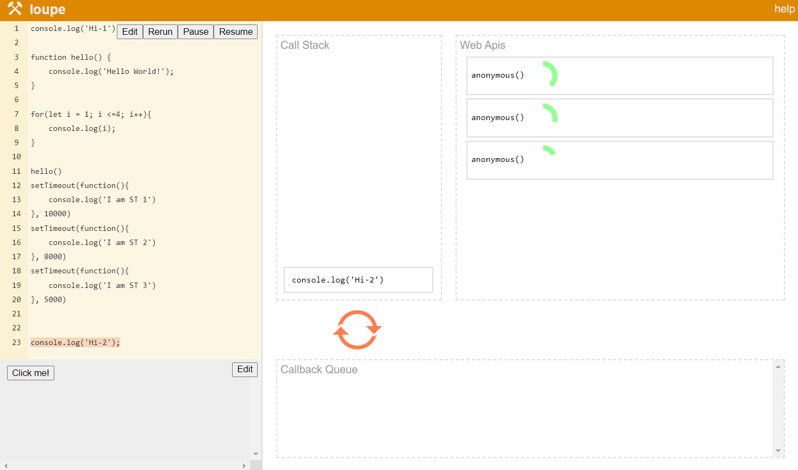
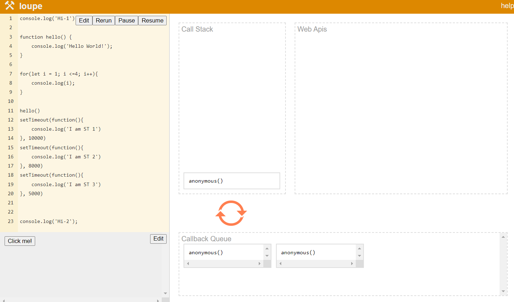
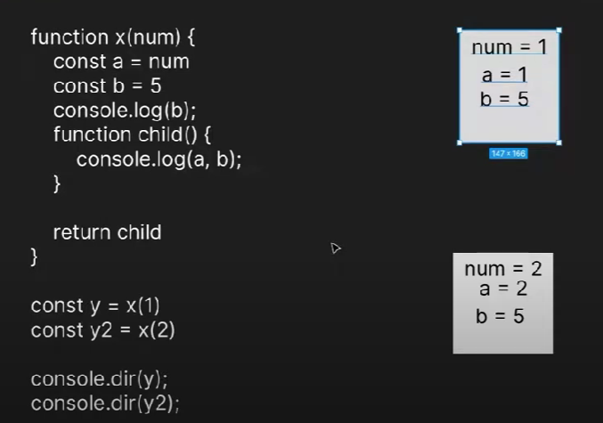
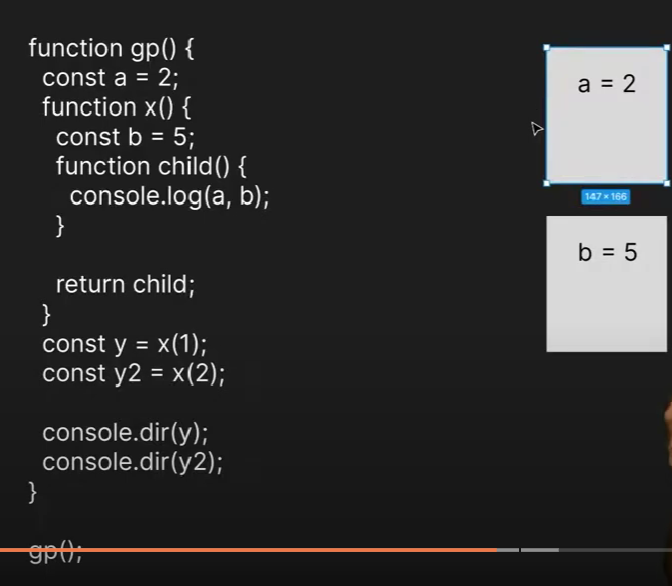
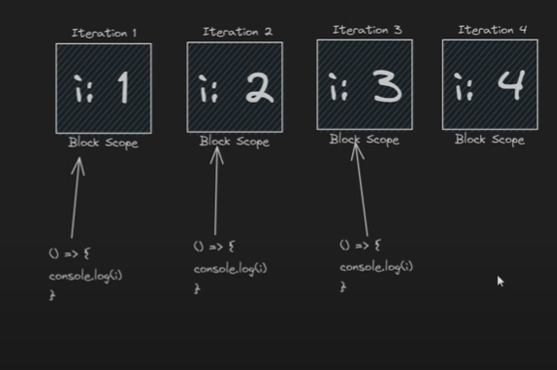
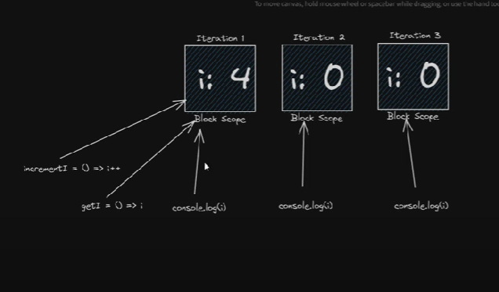

# [Execution Context in JavaScript Explained in Depth | The Complete JavaScript Course | Ep.30](https://www.youtube.com/watch?v=JfW1fBRCeLU&list=PLfEr2kn3s-bo4LwlbyZugHPavhcdW8YMC&index=31)

Till now we have seen memory creation phase and code execution phase in JS. Those were part of the global scope.


Now for normal variables, this was part of the `Global Scope`.

For functions, we have a local scope which starts with {}.

See this eg.

```js
sayHi();

let userName = "KSD";
let userAge = 25;

function sayHi() {
  console.log("Hii");
}

// We can also call the function after defining it
// sayHi()
```

#### We can call the function even before defining it. Reason is, when the memory is created, the call step is skipped and the function and the variables are defined with values `undefined` so when we call the function before defining it, sayHi() here, it searches for a funciton named sayHi() in the memory during code execution phase, since the function is already there, it will execute it with no issues.

---

### Global Execution Context



```js
const username = "Anurag";
const userage = 25;

console.log(username, userage);
```

### Global and Local Execution Context



```js
// debugger

sayHi();

const username = "Anurag";
const userage = 25;

console.log(username, userage);

function sayHi() {
  const a = 14;
  const b = 12;
  console.log(a + b);
}

console.log(`Program Over`);
```

Debug these

#### Since we called sayHi() before defining the function, the local execution context will be created first in the code execution box, then we will see the username and userage variables being getting values.

#### When the function is over, the local execution context also goes away.

## Nested Function Execution Context


```js
// debugger

sayHi();

const username = "Anurag";
const userage = 25;

console.log(username, userage);

function sayHi() {
  const a = 14;
  const b = 12;
  console.log(a + b);
  add(7, 9);
}

function add(x, y) {
  return x + y;
}

console.log(`Program Over`);
```

#### The `X` in the image over add execution context means that after the function add() is done, it goes out of the call stack and it goes away from the execution context.

---

# [Call Stack in JavaScript | The Complete JavaScript Course | Ep.31](https://www.youtube.com/watch?v=kfxITcxEsG0&list=PLfEr2kn3s-bo4LwlbyZugHPavhcdW8YMC&index=32)

#### Call stack in javascript is a mechanism through which the javascript engine keeps in track; inside which function we are in and inside which line we are in.

eg.

```js
// debugger

sayHi();

const username = "Anurag";
const userage = 25;

console.log(username, userage);

function sayHi() {
  const a = 14;
  const b = 12;
  console.log(a + b);
  add(7, 9);
}

function add(x, y) {
  return x + y;
  kuchhBhi();
}

function kuchhBhi() {
  console.log("Kuchh Bhi");
}

console.log(`Program Over`);
```



## Callback Hell

This happens when we define a function and call it inside the same function without giving `base condition` i.e. condition to exit the function.

We will basically write a `recursive function here with no base condition`.

This will keep adding the same function in the call stack and in the end, it will give us a `stack overflow error`.

eg.

```js
function introduce() {
  console.log("Hi I am Saksham");
  introduce();
}

introduce(); // to go inside the function
```

We will get this error

`script.js:2 Uncaught 
RangeError: Maximum call stack size exceeded`

---

# [What is Hoisting? | Most Asked JS Interview Question | The Complete JavaScript Course | Ep.32](https://www.youtube.com/watch?v=E5af3VAaGCs&list=PLfEr2kn3s-bo4LwlbyZugHPavhcdW8YMC&index=33)

Let us see some egs..

```js
console.log(name);

var name = "Love";
// this gives output -> undefined
```

```js
console.log(name);

const name = "Love";
// this gives error
```

```js
console.log(name);

let name = "Love";
// this also gives error
```

## When we try to access variables before defining them, then the variables are said to be hoisted and this process is called hoisting. As seen from the 3 examples above.

#### Actually we can also hoist the variables using let and const also but since ES6, JS has introduced let and const and this keeps the variables in a Temporal Dead Zone (TDZ) just after hoisting them, so it becomes difficult for us to access them while they are in TDZ. Hence we get an error.

#### With var we have no such problems.

### Functions in JS are hoisted properly. I.e. when we define a function, we can call it either before defining them or after defining them.

```js
function hi() {
  console.log("hello");
}

hi();
```

```js
hi();

function hi() {
  console.log("hello");
}
```

Both will give no errors i.e. hoisted properly.

#### Hoisting is not defined in ECMAScript standards but it is widely used in JS.

#### Explain hoisting with memory creation phase, where functions are hoisted and then happens the code execution phase.

# Function Defination types:

### 1. Function Declaration and

### 2. Function Expression

## 1. Normal Way (`Function Declaration`)

```js
function hi() {
  console.log("Hello");
}

hi(); // calling the function
```

## 2. Declaring Functions by storing it in variables (`Function Expressions`)

```js
const hey = function hi() {
  console.log("Hello");
};

hey; // calling the variable which has the function hi()
```

Another way for this, not naming the function, just the variable

```js
// debugger // debug without getting the errors

const hey = function () {
  console.log("Hello");
};

hey; // calling the variable which has the function()
```

#### Now the issue with using functions in the expressions form is, that when we try to call it before defining it, it will not be hosted properly. This is because when we try to define the functions as a variable, it will also behave like a variable.

#### So it will behave in the same manner as var, let and const. var allows hoisting without errors, let and const donot and hence give errors.

## In chrome devtools, when using let and const, code goes into script. When using var, it goes into global.

# Anonymous Function (nameless function)

```js
function() {
    console.log('I am an anonymous function')
}

```

# [Global Scope vs Local Scope in Javascript](https://app.procodrr.com/web/courses/6613af35b495b1c7835f280b?chapter=66239a48b3a48b942238fb19)

### When we get an error at a line, our code stops running at that particular line.

### In global scope our variables can either be inside:

#### 1. Window Object (via var) or

#### 2. Script Scope (via let / const)

If we have made any variable using var, we can declare it by using `window.variableName`

eg.

```js
var name = "Ali";
window.name;
// Ali
```

Same cannot be done for variables declared with let/const.

See this eg. for scope (global and local)

```js
const username = "Anurag";
let userAge = 25;
var a = 50;

function add() {
  debugger;
  const username = "Akash";
  const x = 5;
  const y = 8;
  console.log(x + y);
  console.log(username);
}

function subtract() {
  const x = 15;
  const y = 18;
  console.log(x - y);
  console.log(username);
}

add();
subtract();

console.log("Program Ended");
```



In local Scope for add(), we have: this -> {}, x -> 5, y -> 8

`this` is an object

In local Scope for subtract(), we have: this -> {}, x -> 15, y -> 18

`this` is an object

# [Lexical and Block Scope in JavaScript](https://app.procodrr.com/web/courses/6613af35b495b1c7835f280b?chapter=66239d0923acd2e1b549ed69)

## Closures

Whenever a child function tries to access variables of the parent function, then the child function will try to make a `closure`

## Lexical Scope of a function

Lexical Scope of a particular function means, scope of that own function + scope of all the other outer functions.

eg.

```js
// 'use strict'

const username = "Anurag";
let userAge = 25;
var a = 50;

function subtract() {
  const x = 15;
  const y = 18;
  const z = 28;
  console.log(x - y);
  console.log(username);

  function child() {
    // debugger

    const childName = "Golu";
    console.log(childName);
    console.log(x, z);

    function grandChild() {
      const grandChildName = "Molu";
      console.log(grandChildName);
    }
    grandChild();
  }

  child();
}

subtract();

console.log("Program Ended");
```

Here lexical scope of grandchild are:

- grandchild() (its own scope)
- child() (parent scope)
- subtract() (parent scope)
- global scope (parent scope)

### It means a variable inside grandchild() can access all the variables declared outside of grandchild() and are present in its parent scopes.

### Hence, Inner can access outer but outer cannot access inner.

## Block Scope

Variables declared inside {} is called block scope. They cannot be accessed outside of {}.

### This applies to only let and const, var does not follow this block scope i.e. we can access the variables inside {}, from outside of its scope if we initialize them using var.

eg

```js
{
  let name = "lkj";
}

console.log(name);
// error
```

```js
{
  const name = "lkj";
}

console.log(name);
// error
```

```js
{
  var name = "lkj";
}

console.log(name);
// lkj
```

### Var can go outside the block scope but if the block scope is inside of a function then var cannot go outside of that function.

eg.

```js
let username = "lkj";
function add() {
  let userage = 44;

  {
    var height = 258.44;
    // We can access var here
    // console.log(height) // 258.44
  }

  // We can access var here
  // console.log(height) // 258.44
}

// We can NOT access var here
// console.log(height) // error

add();
```

## Global Declaration and use strict

But if we do `height = 258.44` without using let, var or const, we can access height anywhere(globally) in the code, as this means we are initializing height globally, and this variable value will now go directly into the window object.

However this is not a good practice as scoping is good for us, so to prevent this we can use `use strict` at the top of the code. This will prevent us from using `height = 258.44` and will tell us to initialize it via var, let or const.

`We need to use global variables as less as possible.`

---

# [Higher Order Functions and Callbacks in JavaScript](https://app.procodrr.com/web/courses/6613af35b495b1c7835f280b?chapter=662a2ea8aaa9d66aa03bc637)

A Higher Order function is when we:

- Return a function from inside a function
- Pass a function as an argument inside another function

In normal order functions, we can pass arrays, objects, number, string, bool etc. and return them too!

### To print any element in object format, use `console.dir()`

Primitives will be printed as it is.  
Non primitives will be printed as objects eg functions, object literals, arrays.

Functions will always behave as objects.

```js
function add(a, b) {
  console.log(a + b);
}

console.dir(add);

/*

ƒ add(a, b)
arguments
: 
null
caller
: 
null
length
: 
2
name
: 
"add"
prototype
: 
{}
[[FunctionLocation]]
: 
VM34648:1
[[Prototype]]
: 
ƒ ()
[[Scopes]]
: 
Scopes[1]
*/

add.a = 44;
// 44

add.b = 11;
// 11

console.dir(add);

/*

ƒ add(a, b)
a
: 
44

b
: 
11

arguments
: 
null

caller
: 
null

length
: 
2

name
: 
"add"

prototype
: 
{}

[[FunctionLocation]]
: 
VM34701:1
[[Prototype]]
: 
ƒ ()
[[Scopes]]
: 
Scopes[1]
*/
```

### Let us now see an example of putting in a function inside another function

```js
function a(b) {
  console.dir(b);
  b();
}

function sayHi() {
  console.log(`Hiiiiiii`);
}

a(sayHi);
```

- Here first we will go to `a(sayHi)` (pass only the name of the function).
- This takes us to a() where we pass sayHi() as argument. Here sayHi() as argument and b() as parameter are same. I.e. sayHi() becomes b() when passed as a parameter in a().
- Inside a() we will, first do console.dir(b) then we will call b() or sayHi(), which will take us inside sayHi() and we then print `Hiiiiii`.

<br>

#### Another way (not naming a function i.e. via anonymous function)

```js
function a(b) {
  console.dir(b);
  b();
}

a(function () {
  console.log(`Hiiiiiii`);
});
```

- Here we wrote an entire function inside the call statement ().

So here a() becomes a `Higher order function` as we are passing a function inside of it as an argument.

When we need to use sayHi() function multiple times, better to name it rather than writing the same function again and again.

# Callback Function (IMP)

## When we are calling a function say a() and we pass another function b() inside of a() as an argument then the function `b()` is said to be a `callback function` and the function `a()` is said to be a `higher order function`.

see egs

```
In this code bit from above eg:

a(function() {
    console.log(`Hiiiiiii`);
});


This portion is a callback function:

function() {
    console.log(`Hiiiiiii`);
}

i.e. portion inside of a()
```

Similarly here:

```
function sayHi() {
    console.log(`Hiiiiiii`);
}

a(sayHi);

sayHi() inside of a() is a callback function as we call it when we pass a().
```

---

# [setTimeout and setInterval in JavaScript](https://app.procodrr.com/web/courses/6613af35b495b1c7835f280b?chapter=662a32a8a4b980bcc2f37b62)

Both of these are Higher Order Functions

## setTimeout()

Syntax: `setTimeout() {js code}`

so whatever is written inside {} will be treated as JS code.

Now setTimeout is not present in the window object. So if we do:

`setTimeout()` in console, we get this error: `TypeError: Failed to execute 'setTimeout' on 'Window': 1 argument required, but only 0 present.
    at script.js:1:1`

---

Now if we do: `setTimeout('Hiii')`, i.e. passing a string inside (), we get this error:

`ReferenceError: Hiii is not defined
    at <anonymous>:1:1
(anonymous) @ VM715:1
setTimeout (async)
(anonymous) @ script.js:1`

In this case, we included a string but setTimeout considered it as a variable and since that `Hiii` variable was not declared, we got an error.

---

Now if we do: `setTimeout('console.log("hi")')`

Then we will get no error as this time we entered a string 'console.log("Hiii")', but setTimeout will consider this as a valid code.

Now if we go to sources tab, then we see that here inside of script.js file, we have our code setTimeout('console.log("hi")') but we get redirected to a `VMxx` file where the part inside `''` is extracted as code and we get `console.log("Hiii")`

We see output in console from this `VMxx file`

We can also print output after some time using this `setTimeout() function`.

Syntax: `setTimeout(code, time in ms)`

eg. `setTimeout('console.log("Hi")', 3000)` i.e. `print "Hi" after 3000 ms or 3 sec.`

Use `` i.e. template literals to print code in multiple lines or include multiple code bits in one line.

eg. 1

```js
setTimeout(
  `console.log('HI')

console.log('Line 2 code')
`,
  5000
);

// 3
// VM1347:1 HI
// VM1347:3 Line 2 code
```

Here we get a three as output too, this `3` is the `return value of the setTimeout() function aka the TIMER ID`

eg2 All code in one line, separated by `;`

```js
setTimeout(
  `console.log('HI'); console.log('Line 2 code separated by ;')`,
  5000
);

// 3
// VM1347:1 HI
// VM1347:3 Line 2 code
```

## clearTimeout()

### Now we use this function when we want to stop an already ongoing setTimeout() process.

#### So if we write a setTimeout code, a timer already starts in JS background and it the code executes when the timer is reached its time, so we can use clearTimeout to stop that timer and prevent the code from executing.

eg.

Normal code

```js
setTimeout('console.log("Hi after 2sec")', 2000);
setTimeout('console.log("Hi after 8sec")', 8000);
setTimeout('console.log("Hi after 12sec")', 12000);
// 4
// VM479:1 Hi after 2sec
// VM486:1 Hi after 8sec
// VM491:1 Hi after 12sec
```

##### Notice carefully, each `setTimeout()` is making a separate `VMxxx` file for itself (see in output).

Code with clearTimeout() and Output

```js
setTimeout('console.log("Hi after 2sec")', 2000);
setTimeout('console.log("Hi after 8sec")', 8000);
setTimeout('console.log("Hi after 12sec")', 12000);

// 4 (timer id of 12000)
// VM51:1 Hi after 2sec
// VM77:1 Hi after 8sec
clearTimeout(4); // preventing 12000 timeout code from executing
// undefined (no output)
```

Now in our node JS environment, we can get timer id by storing the function in a variable and doing console.log().

eg.

```js
const timerId = setTimeout(`console.log("Hi after 2sec")`, 2000);
// undefined
// VM1112:1 Hi after 2sec

timerId;
// 2
```

## Using setTimeout() as a Higher Order Function

We can also include functions in setTimeout(), for this `we need not put the code in ''` and by doing this, our code inside setTimeout will not go into a `VMxx` file as the function is in the script.js file itself.

let us see some examples:

```js
const timer3 = setTimeout(a, 3000);

function a() {
  console.log(`Hey!, I am a function code!!`);
}
```

Now notice that inside setTimeout, we only used `a` and not `a()` i.e. we did not call the function. It is because if we did use `a()` then inside setTimeout, we will get the return value of the function a() i.e. undefined here. And setTimeout will just casually run the function but it will not give any delay.

```js
const timer3 = setTimeout(a(), 3000);

function a() {
  console.log(`Hey!, I am a function code!!`);
}

// Output -> Hey!, I am a function code!!
```

<br>
case 2 (directly writing undefined)

```js
const timer3 = setTimeout(undefined, 3000);

function a() {
  console.log(`Hey!, I am a function code!!`);
}

// Output -> (no output as code inside setTimeout() is undefined)
```

Now we can also put some other things inside setTimeout. These are called arguments, we can access them via the `arguments array` inside the function definition

eg.

```js
const timer3 = setTimeout(a, 3000, "arguments1", "hgfds", 785, 654, [1, 53.7]);

function a() {
  console.log(`Hey!, I am a function code!!`);

  // Accessing the arguments from setTimeout via the arguments array

  console.log(arguments[2]); // output ->
  // Hey! I am a function code!!
  // 785
}
```

Now putting arguments and even the time inside setTimeout are optional.

### Interview Q. Find the output order of the following code:

```js
const timer1 = setTimeout('console.log("Hi after 2sec")', 2000);
const timer2 = setTimeout('console.log("Hi after 0sec")', 0);
const timer3 = setTimeout(a, 3000, "arguments1", "hgfds", 785, 654, [1, 53.7]);

function a() {
  console.log(`Hey!, I am a function code!!`);
}

console.log("I am KSD");
```

ans ->

1. I am KSD
2. Hi after 0 sec. (prints after 0 sec)
3. Hi after 2 sec. (prints after 2 sec)
4. Hey I am a function code (prints after 3 sec)

Now 3 and 4 are pretty obvious but what about 1. and 2.

### Here remember that setTimeout function is asynchronous in nature and it will always print after all the synchronous code even if its time set is 0sec.

---

## setInterval() and clearInterval()

setTimeout() runs the code `exactly once` after a certain time interval.

setInterval() runs the code `repeatedly` after a certain time interval.

### It will not stop. To stop it, use `clearInterval(timerId)`

We can also use clearTimeout() and clearInterval() interchangeably for both setTimeout and setInterval but it is not preferred.

eg.

```js
const timer3 = setInterval(a, 3000);

function a() {
  console.log(`Hey!, I am a function code!!`);
}

clearInterval(timer3);
```

#### We can also pass anonymous functions in setTimeout and setInterval

```js
const timer3 = setTimeout(function () {
  console.log(`Hey!, I am a function code!!`);
}, 3000);

clearInterval(timer3);
```

```js
const timer3 = setInterval(function () {
  console.log(`Hey!, I am a function code!!`);
}, 3000);

clearInterval(timer3);
```

# [Event Loop and Callback Queue in JavaScript | The Complete JavaScript Course | Ep.37](https://www.youtube.com/watch?v=JMeT-Uskm7M&list=PLfEr2kn3s-bo4LwlbyZugHPavhcdW8YMC&index=39)

Visit this website and open the dev tools console to see it in full action:

### [Event Loupe](http://latentflip.com/loupe/?code=JC5vbignYnV0dG9uJywgJ2NsaWNrJywgZnVuY3Rpb24gb25DbGljaygpIHsKICAgIHNldFRpbWVvdXQoZnVuY3Rpb24gdGltZXIoKSB7CiAgICAgICAgY29uc29sZS5sb2coJ1lvdSBjbGlja2VkIHRoZSBidXR0b24hJyk7ICAgIAogICAgfSwgMjAwMCk7Cn0pOwoKY29uc29sZS5sb2coIkhpISIpOwoKc2V0VGltZW91dChmdW5jdGlvbiB0aW1lb3V0KCkgewogICAgY29uc29sZS5sb2coIkNsaWNrIHRoZSBidXR0b24hIik7Cn0sIDUwMDApOwoKY29uc29sZS5sb2coIldlbGNvbWUgdG8gbG91cGUuIik7!!!PGJ1dHRvbj5DbGljayBtZSE8L2J1dHRvbj4%3D)

Use this code:

```js
console.log("Hi-1");

function hello() {
  console.log("Hello World!");
}

for (let i = 1; i <= 4; i++) {
  console.log(i);
}

hello();
setTimeout(function () {
  console.log("I am ST 1");
}, 10000);
setTimeout(function () {
  console.log("I am ST 2");
}, 8000);
setTimeout(function () {
  console.log("I am ST 3");
}, 5000);

console.log("Hi-2");
```





#### The Spinner in orange is the `Event Loop`

#### The Asynchronous code will run once all synchronous code is done running i.e. the call stack is empty of synchronous code.

## Asynchronous Code in JS:

#### The code which does not go directly into the `function call stack` but goes into the `web API`, from there it goes into `callback queue` and then via `event loop` finally comes into `call stack` is called `Asynchronous code`.

eg. Promises, setTimeout(), event listeners etc.

## The setTimeout function comes back into the call stack from the callback queue via the event loop. If there are multiple setTimeout functions, they come into the call stack one at a time, also they enter the call stack when it is completely empty.

# [Returning Functions with Closures in JavaScript | The Complete JavaScript Course | Ep.38](https://www.youtube.com/watch?v=w_-fVsa6qns&list=PLfEr2kn3s-bo4LwlbyZugHPavhcdW8YMC&index=41)

In higher order functions, not only can we pass other functions as arguments, but we can also return other functions from a function.

Here we will see the latter. Also we will look at closures.

```js
function parent() {
  let a = 7;
  let b = 5;

  function add() {
    console.log(a + b);
  }

  return add;
}

const add1 = parent();

console.dir(add1);
```

#### Flow

- Now here we see that when we call the add1, it will call parent()
- Since parent returns add, it will return the whole add()
- In that add we will get a + b

#### Now the question is will we have access to a and b since we are only getting add() returned.

#### Ans. YES. We will have access to a and b. When a function is returned by a higher order function and it uses variables which are defined in its parent scope and it tries to access them then we call these variables as closures. Here a & b are closures. So not only the inner function is returned, but also the closure variables are returned.

Let us see another example:

```js
function grandParent() {
  let a = 7;

  function parent() {
    let b = 5;

    function add() {
      console.log(a + b);
    }

    return add;
  }

  return parent();
}

const add1 = grandParent();

console.dir(add1);
```

Here we will have a and b as closures also but it will be shown separately. Here `a` is the closure of grandParent() while `b` is the closure of parent(). We see here that grandparent calls parent, parent calls add. Add() takes in a & b. It takes `a` from its parent's parent i.e. grandParent() and it takes `b` from its parent i.e. parent(). So the closures here are a and b.

#### - When we do `return parent()` we are returning the call of parent function i.e. we are going inside the parent() which is the add() here and then we're returning whatever is inside of it say `return a+b`.

#### - But when we do `return parent`, we are returning the whole parent(). So there is a difference here.

In eg. 2 we did `return parent()` i.e. we want to go inside parent() and then return whatever was inside of it. When we did `return add`, we are returning the whole add().

Also we used `console.dir()` to see scopes and then see closures inside of it.

### We can also return anonymous functions too!!

```js
function parent() {
  let a = 7;
  let b = 5;

  return function () {
    console.log(a + b);
  };
  //   add() -> anonymous()
}

const add1 = parent();

console.dir(add1);
```

# [Closures](https://www.youtube.com/watch?v=d4_hcQkGkfI&list=PLfEr2kn3s-brmujLuaVPA_FTkflKbMc5x&index=7)

Closures in JavaScript are functions that have access to variables from another function’s scope. This is made possible because of the way JavaScript handles scope. Specifically, a closure is created when a function is defined within another function, allowing the inner function to access the outer function's variables even after the outer function has finished executing.

### So closures basically are a combination of functions bundled together with its lexical scope. Closures also give us access to outer function's scope from the inner function

### `Parent Scope Variables + Child Function (when parent variables are used in them) = Closures()`

Let us see this example:



Here we see that function block is skipped initially and we call `y` initially, this will call the x(1) where 1 = num value which is then passed to `a` (see block 1).

Same happens when y2 is called. The same function block is called but the parent's memory is different here (see lower block) so function code can be the same but the memory block in both cases are different. Hence closures formed in both the cases are different too!!

### Higher Level Closures

Let us see this example now:



Here we have a grand parent (gp) function inside of which we have an x() inside of which we have a child().

So here `a` will form closure with gp() and `b` will form closure with x() when they are called and used inside the child().

Here we see 2 memory blocks, one for `gp()` where we will find `a` and another block for `x()` where we will find `b`.

### Updating the Closures

Let us see the following example:

```js
function x(num) {
  let a = num;
  function child() {
    a++;
  }
  return child;
}

const y = x(1);
const y2 = x(5);

console.dir(y);
console.dir(y2);
```

In this code, `a++` will only execute when the function child() is called. When child() is called, then only we will see `a` getting updated to `a++`. Also we used `y` and `y2` to call x().

Remember: Here though we are calling the same function; it will form different closures each time it is called, like we saw in the previous examples.

So it will also get updated accordingly.

So here when `y` is called, initially `a` has the value of `num i.e. 1`. When `y2` is called, then `a` initially has the value of `num i.e. 5`.

So call the functions to update each of their closures separately.

i.e. do `y()` to update the closure of `x() (a = 1)` and do `y2()` to update the closure of `x() (a = 5)`.

Also do `console.dir(y)` and `console.dir(y2)` after calling each function individually to see their closure's updated results.

### Closures Real Life Examples

```js
function doSomeThing() {
  const userName = "John";

  function callBackFunction() {
    console.log(userName);
  }

  console.dir(callBackFunction);

  setTimeout(callBackFunction, 2000);
}

doSomeThing();
```

Normally we expect username to be deleted as we are using setTimeout but since we are using a setTimeout and we are calling a function which is taking a value from its parent scope it is forming a closure and hence username is not deleted and we will see `John` as the output.

Let us see another example

```js
function createOnceFunction() {
  let executed = false;

  return function () {
    if (!executed) {
      executed = true;

      console.log(
        "Congratulations, you have successfully called the function!!"
      );
    }
  };
}

createOnceFunction();
```

Here anonymous function (child function) is forming closure with createOnceFunction() as it takes in the executed variable from it. So even if createOnceFunction() is over, the executed variable will not be deleted as it has formed a closure with the memory of the child Function() which is being returned.

Now let us see the output:

```js
function createOnceFunction() {
  let executed = false;

  return function () {
    if (!executed) {
      executed = true;

      console.log(
        "Congratulations, you have successfully called the function!!"
      );
    }
  };
}

const z = createOnceFunction();
z();
// VM5050:8 Congratulations, you have successfully called the function!!
// undefined

z();
// undefined
```

In this case when we call the function the 1st time, we will see the print value, but when we call it the second time, nothing happens (no output print). This is because in the second time the executed variable is now true and so it won't print anything as for it to print, its value should be false. So these types of functions are also important where we need to execute them only once. This is called `ONCE FUNCTION`.

### Use case of Closures: We can make a memorized function out of this

### Disadvantage - The variable is not deleted from the memory even after we have called the function and the function execution is done. Also every time we make a new call, a new memory is created for this function. This fills the memory with too much `junk variables` and this is called `memory leak`.

---

# [Difference between Methods and Functions in JavaScript | The Complete JavaScript Course | Ep.39](https://www.youtube.com/watch?v=xzTmgO-toMg&list=PLfEr2kn3s-bo4LwlbyZugHPavhcdW8YMC&index=42)

In JS all methods are functions but all functions are not methods.

### When is a function a method:

### ans -> When we keep the functions inside the objects, we call it methods

eg.

```js
const maths = {
  add: function add(a, b) {
    return a + b;
  },
};

maths.add(4, 7);
```

We needed the object key here for the method to work properly. Here `add` is now a method inside the `maths` object.

We access these methods via the `.` operator.

Let us write some more `methods i.e. functions inside the objects (with keys)`.

1. Subtract

```js
const maths = {
  subtract: function subtract(a, b) {
    return a - b;
  },
};

maths.subtract(4, 7);
```

2. Square

```js
const maths = {
  square: function square(a) {
    return a ** 2;
  },
};

maths.square(40);
```

We can also write all these methods under one single maths object

```js
// No need to name functions compulsorily for methods, we can identify them by their keys

const maths = {
  add: function (a, b) {
    return a + b;
  },
  square: function (a) {
    return a ** 2;
  },
  subtract: function (a, b) {
    return a - b;
  },
};
```

### It is important to use `return` for getting output result instead of `console.log` else we will get undefined.

eg.

`maths.add(2,6) + 2`

- using console.log() -> maths.add(2,6) = undefined, so undefined + 2 = NaN
- using return -> maths.add(2,6) = 8, so 8 + 2 = 10

### Now ES6 has provided some new ways to create math methods

eg1 Subtract

```js
const es6 = {
  subtract(a, b) {
    return a - b;
  },
  cube(a) {
    return a ** 3;
  }
};

es6.subtract(4, 7);
es6.cube(5);
```

### No need to use key and value for this new type.


### Some other method examples:

`[12, 6].push()` -> This is a method as we know array is an object and when we use `object.function()` then we are referring to that function as a method. `So push is a method here`

#### There are some string methods too but string is a non primitive datatype, so how can we use methods with them. Actually each string has an object wrapped around them, and we use methods with that wrapped object, the result of which is that we can use methods with strings (a non primitive datatype). eg. `'hi'.toUpperCase()`

---

# [Arrow Functions in JavaScript | ES6 | The Complete JavaScript Course | Ep.40](https://www.youtube.com/watch?v=EDnmuuBTbHw&list=PLfEr2kn3s-bo4LwlbyZugHPavhcdW8YMC&index=43)

This arrow function is another way of writing functions as expressions.

### Eg -> 
```js
const add = (a, b) => {
    return a + b
}

add(5,7)
// 12
```

Now here we used return keyword and {}, hence this is called `explicit return`.

Now let us do an implicit return i.e. using no return keyword and {}

```js
const multiply = (a, b) =>  a * b


multiply(5,7)
// 35
```

We can also write implicit function using ().

```js
const multiply = (a, b) =>  (
    a * b
)


multiply(5,7)
// 35
```

#### This is very useful when we are dealing with callback functions. I.E, we can use arrow functions to write callback functions due to its compact nature.

eg.

```js
setTimeout(() => (console.log('Hi')), 2000)
```

`Empty () means no arguments` so above function (the inner function is an anonymous function and also an arrow function).

When there is only one argument, we can also choose to write it without ()

eg. 
```js
const cube = num => num ** 3;
cube(4);
// 64
```

---

# [You don't Know FOR LOOP yet!](https://www.youtube.com/watch?v=_WWVfL5D5lc&list=PLfEr2kn3s-brmujLuaVPA_FTkflKbMc5x&index=2)

## Basics

```js
for(let i = 1; i <= 3; i++) {
    console.log(i);
}

/* 
1
2
3
*/
```

```js
for(var i = 1; i <= 3; i++) {
    setTimeout(() => (
        console.log(i)
    ), 3000)
}
/* 
4
4
4
*/

```
1. Here `var` keyword keeps the variables in a global scope and the for loop goes from 1 to 3 and then 4 to get out of the loop. 

2. Then the setTimeout() is executed which gives us 4 4 4 after 3 second interval of each

<br>
To fix this, we will use the `let` keyword.

```js
for(let i = 1; i <= 3; i++) {
    setTimeout(() => (
        console.log(i)
    ), 3000)
}
/* 
1
2
3
*/
```

`Let` here forms a local scope which lets us get 3 local scopes for 1 , 2 , and 3 each, so we will also get setTimeout() 3 times, inside each of these 3 scopes. For 4, we will not get any such thing as the loop functionality is already over.




### What Actually Happens:
Since the loop is using var to declare i, i is global-scoped and not block-scoped.
By the time the setTimeout callback functions are executed, the loop has already completed, and i has reached its final value, which is 4.
Therefore, when the setTimeout callbacks run, they all reference the same i, which is 4.

#### Output:
After 3 seconds, the console will log:

```sh
4
4
4
```

### Why Does This Happen?
This behavior is due to how JavaScript handles closures. The setTimeout callbacks are closing over the same i variable, which ends up being 4 after the loop finishes.

#### How to Fix It:
If you want to log 1, 2, and 3 instead of 4 each time, you can use let instead of var, which is block-scoped:

```javascript
for (let i = 1; i <= 3; i++) {
    setTimeout(() => (
        console.log(i)
    ), 3000)
}


// With let, the output will correctly be:
1
2
3
```

Each iteration of the loop will have its own separate i value due to the block-scoping of let.

--- 

### Some Tips: 
1. If we have only one line of code to execute, this includes the setTimeout(), then we can use the for loop without using the {}, this will not give us any error. It will create a block scope even without using {}.

2. But if we try to do it with if-else, then we will definitely get an error (when using let and const)

3. But if we use var (which is a global scope) then we can use loop and if-else without using any brackets {}, in both cases without getting any errors.

## Optional `for` expressions
All three expressions in the head of the for loop are optional. For example, it is not required to use the initialization block to initialize variables:

```js
let i = 0;
for (; i < 9; i++) {
  console.log(i);
  // more statements
}
```

Ok ✅✅ 

Like the initialization block, the condition part is also optional. If you are omitting this expression, you must make sure to break the loop in the body in order to not create an infinite loop.

```js
for (let i = 0; ; i++) {
  console.log(i);
  if (i > 3) break;
  // more statements
}
```

You can also omit all three expressions. Again, make sure to use a `break` statement to end the loop and also modify (increase) a variable, so that the condition for the break statement is true at some point.

```js
let i = 0;

for (;;) {
  if (i > 3) break;
  console.log(i);
  i++;
}
```

However, in the case where you are not fully using all three expression positions — especially if you are not declaring variables with the first expression but mutating something in the upper scope — consider using a `while` loop instead, which makes the intention clearer.

```js
let i = 0;

while (i <= 3) {
  console.log(i);
  i++;
}
```

## Lexical declarations in the initialization block

Declaring a variable within the initialization block has important differences from declaring it in the upper scope, especially when creating a closure within the loop body. For example, for the code below:

```js
for (let i = 0; i < 3; i++) {
  setTimeout(() => {
    console.log(i);
  }, 1000);
}

/*
1
2
3
*/
```
It logs 0, 1, and 2, as expected. 


However, if the variable is defined in the upper scope:

```js
let i = 0;
for (; i < 3; i++) {
  setTimeout(() => {
    console.log(i);
  }, 1000);
}
/*
3 
3
3
*/
```

It logs 3, 3, and 3. The reason is that each setTimeout creates a new closure that closes over the i variable, but if the i is not scoped to the loop body, all closures will reference the same variable when they eventually get called — and due to the asynchronous nature of setTimeout, it will happen after the loop has already exited, causing the value of i in all queued callbacks' bodies to have the value of 3.

#### Basically when we do like this, then setTimeout() will call `i` when it is finished with the loop i.e. when `i` will be 3. 

#### This also happens if you use a var statement as the initialization, because variables declared with var are only function-scoped, but not lexically scoped (i.e. they can't be scoped to the loop body).

```js
for (var i = 0; i < 3; i++) {
  setTimeout(() => {
    console.log(i);
  }, 1000);
}
// Logs 3, 3, 3
```

The scoping effect of the initialization block can be understood as if the declaration happens within the loop body, but just happens to be accessible within the condition and afterthought parts. 

#### More precisely, let declarations are special-cased by for loops — if initialization is a let declaration, then every time, after the loop body is evaluated, the following happens:

- A new lexical scope is created with new let-declared variables.
- The binding values from the last iteration are used to re-initialize the new variables.
- afterthought is evaluated in the new scope.

So re-assigning the new variables within afterthought does not affect the bindings from the previous iteration.


---

A new lexical scope is also created after initialization, just before condition is evaluated for the first time. These details can be observed by creating closures, which allow to get hold of a binding at any particular point. 

For example, in this code a closure created within the initialization section does not get updated by re-assignments of i in the afterthought:

```js
for (let i = 0, getI = () => i; i < 3; i++) {
  console.log(getI());
}
// Logs 0, 0, 0
```

This does not log "0, 1, 2", like what would happen if getI is declared in the loop body. This is because getI is not re-evaluated on each iteration — rather, the function is created once and closes over the i variable, which refers to the variable declared when the loop was first initialized. Subsequent updates to the value of i actually create new variables called i, which getI does not see. 

### Basically initialization statement is executed only once, so even though we are calling getI() in each loop iteration, it is not getting updated and will call i = 0 each time when the loop is run.

So 3 blocks each of `i=0` are being created.

#### A way to fix this is to re-compute getI every time i updates:

```js
const arr = [];
for (let i = 0, getI = () => i; i < 3; i++, getI = () => i) {
  arr.push(getI);
  console.log(getI());
}
// Logs 0, 1, 2

arr

/*
(3) [ƒ, ƒ, ƒ]
0
: 
() => i
length
: 
0
name
: 
"getI"
arguments
: 
(...)
caller
: 
(...)
[[FunctionLocation]]
: 
script.js:2
[[Prototype]]
: 
ƒ ()
[[Scopes]]
: 
Scopes[3]
0
: 
Block {i: 0}
1
: 
Script {arr: Array(3)}
2
: 
Global {window: Window, self: Window, document: document, name: '', location: Location, …}
1
: 
() => i
length
: 
0
name
: 
"getI"
arguments
: 
(...)
caller
: 
(...)
[[FunctionLocation]]
: 
script.js:2
[[Prototype]]
: 
ƒ ()
[[Scopes]]
: 
Scopes[4]
0
: 
Block {i: 1}
1
: 
Block {i: 0}
2
: 
Script {arr: Array(3)}
3
: 
Global {window: Window, self: Window, document: document, name: '', location: Location, …}
2
: 
() => i
length
: 
0
name
: 
"getI"
arguments
: 
(...)
caller
: 
(...)
[[FunctionLocation]]
: 
script.js:2
[[Prototype]]
: 
ƒ ()
[[Scopes]]
: 
Scopes[4]
0
: 
Block {i: 2}
1
: 
Block {i: 0}
2
: 
Script {arr: Array(3)}
3
: 
Global {window: Window, self: Window, document: document, name: '', location: Location, …}
length
: 
3
[[Prototype]]
: 
Array(0)*/
```

#### Now getI() is also getting the updated `i` value as it is placed in the increment block.

The i variable inside the initialization is distinct from the i variable inside every iteration, including the first. I.e. getI() in increment and getI() in initialization are 2 separate functions with different scopes.  


So, in this example, getI() returns 0, even though the value of i inside the iteration is incremented beforehand:

```js
for (let i = 0, getI = () => i; i < 3; ) {
  i++;
  console.log(getI());
}
// Logs 0, 0, 0
```

In fact, you can capture this initial binding of the i variable and re-assign it later, and this updated value will not be visible to the loop body, which sees the next new binding of i.

```js
for (
  let i = 0, getI = () => i, incrementI = () => i++;
  getI() < 3;
  incrementI()
) {
  console.log(i);
}
// Logs 0, 0, 0
```

#### Here there are 3 statements in `initialization` and we are not calling any functions in incrementation, so the increment() and getI() will point to `i=0` only and then make closures with it, for all loop durations. 

Now we know that when a loop is over, in `let` we  make a new scope, copy the previous scope's value and now i++ will work on that scope, but here instead of i++, we are calling the increment() which increments the initialization scope value here and not the new scope's value, so when we do console.log(), we will get 0 i.e. value of second scope when i=1 and 0 again for i=3 which is the third scope's value, but behind the scenes the first scope's value will increase from 1 to 2, 2 to 3 and 3 to 4.  



## Using for without a body (i.e. no {})
The following for cycle calculates the offset position of a node in the afterthought section, and therefore it does not require the use of a statement section, a semicolon is used instead.

```js
function showOffsetPos(id) {
  let left = 0;
  let top = 0;
  for (
    let itNode = document.getElementById(id); // initialization
    itNode; // condition
    left += itNode.offsetLeft,
      top += itNode.offsetTop,
      itNode = itNode.offsetParent // afterthought
  ); // semicolon

  console.log(
    `Offset position of "${id}" element:
left: ${left}px;
top: ${top}px;`,
  );
}

showOffsetPos("content");

// Logs:
// Offset position of "content" element:
// left: 0px;
// top: 153px;
```

#### Note that the semicolon after the for statement is mandatory, because it stands as an empty statement. Otherwise, the for statement acquires the following console.log line as its statement section, which makes the log execute multiple times.

## Using for with two iterating variables
You can create two counters that are updated simultaneously in a for loop using the comma operator. Multiple let and var declarations can also be joined with commas.

```js
const arr = [1, 2, 3, 4, 5, 6];
for (let l = 0, r = arr.length - 1; l < r; l++, r--) {
  console.log(arr[l], arr[r]);
}
// 1 6
// 2 5
// 3 4
```