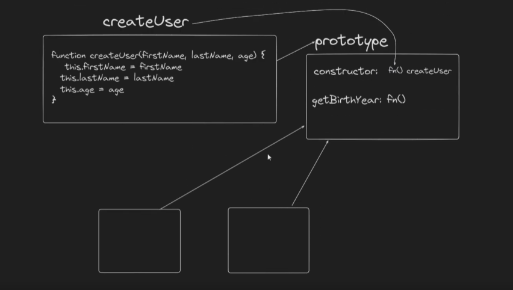

# [What is API? Talking to the Outside World using JSON](https://app.procodrr.com/web/courses/6613af35b495b1c7835f280b?chapter=663640fac04330e5d87280c5)

JSON -> JavaScript Object Notation

Some rules:

- keys will always have double inverted commas and so do the values in strings
- It should not have comma after the last value

For API testing, use any of these:

- Thunder Client (VS code extension)
- Postman

API -> Application Program Interface

We make HTTP requests like GET, POST etc.. to access the outside world data via APIs.

# [What is XMLHttpRequest?](https://app.procodrr.com/web/courses/6613af35b495b1c7835f280b?chapter=66363b47c07f174386b0de4b)

function sayHi() {}

sayHi() => returns undefined

new sayHi() => returns an object made via sayHi()

In earlier days, data was transmitted in the XML format, now it is transmitted in JSON format.

```ssh
Q1  What is the primary purpose of the new keyword in JavaScript?

A1 To create a new object

---

Q2  What is XMLHttpRequest (XHR)?

A2 An object to handle HTTP requests

---

Q3  How can we send a request using XHR?

A3  By calling the send() method

---

Q4 How would we know when we got the data from XHR?

A4 By checking the readyState property

---

Q5 What is the purpose of the onload event handler property in XHR?

A5 To handle HTTP errors

---

Q6 What is the purpose of the readystatechange event in XHR?

A6 To handle HTTP requests
```

Let us make a simple app using xhr

```html
<!DOCTYPE html>
<html lang="en">
  <head>
    <meta charset="UTF-8" />
    <meta name="viewport" content="width=device-width, initial-scale=1.0" />
    <title>XML HTTP Request => Random Dog Image Generator</title>
    <script src="./script.js" defer></script>
  </head>
  <body>
    <h1>Random Dog Image Generator</h1>
    <button>Generate a new dog</button>

    <p></p>
  </body>
</html>
```

```js
const img = document.querySelector("img");
const button = document.querySelector("button");

button.addEventListener("click", (e) => {
  const xhr = new XMLHttpRequest();

  xhr.responseType = "json";

  // xhr.addEventListener("load", () => {
  //   img.src = xhr.response.message; // the url
  //   console.log(xhr);

  //   // console.log(JSON.parse(xhr.response));
  //   console.log(xhr.response);
  //   // normally it takes time for an api to send data in response, so we used a load event listener here.
  //   // This will give us the response output when the response has been loaded.
  // });

  xhr.onload = () => {
    img.src = xhr.response.message; // the url
    console.log(xhr);

    // console.log(JSON.parse(xhr.response));
    console.log(xhr.response);
  };

  // setup the request
  // xhr.open('GET', 'https://dog.ceo/api/breeds/image/random');
  xhr.open("GET", "https://dog.ceo/api/breeds/image/random");
  // convention, use uppercase for request type for all browser compatibility

  // send the request
  xhr.send();
});
```

Takeaways:

- We need to call the xhr once we click on the button
- First we create an XMLHttpRequest and store it in a variable xhr. We use `new` with it to make the return type an object.
- Then we set up the request using xhr.open(request type, request url)
- Then we send the request via xhr.send()
- We will get the response after some time (initially response is an empty string), response usually comes in string type data after some time.
- So we can set it to come in JSON type using xhr.responseType = 'json' (else convert it to json inside load event listener using JSON.parse())
- Now we can put an event listener (load) with xhr, this will ensure to give us the desired response data when the response is loaded as it usually takes some time for the response to get loaded.
- First when response comes, we will update the image src (this src url is in the message property of response)
- Then clg the response or the entire xhr request (optional)
- Alternatively, instead of using a load event listener on xhr, we can do xhr.onload and follow the same steps as it does the same thing

(Refer the code above)

---

# [Synchronous vs Asynchronous Javascript](https://app.procodrr.com/web/courses/6613af35b495b1c7835f280b?chapter=66373424f5c705522b90762c)

JS engine is single threaded -> Does only one thing at a time.

So normal codes are executed instantly by JS engine.

But for code like setTimeout, setINterval etc which take some amount of time to execute, these types of codes are dealt as follows:

- JS engine (single threaded) sends these types of code to the browser and asks the browser to keep a track on it until it gets executed (browser is made up of c++ or some other type of language and hence it is multi threaded).

- Till that code is getting executed, JS engine executes all the other synchronous tasks and sends all the asynchronous tasks to the browser.

- As an asynchronous task is executed, it is sent back to the JS engine where the result is displayed

(See the event loop and callback queue video)

### Synchronous code runs line by line in a Single Thread, each task waits for its previous task to get done and then it moves forward in a sequential manner maintaining order and control.

### Asynchronous task runs in such a fashion where each task runs independently and they do not depend on the previous task to get finished. This model enhances responsiveness and efficiency, particularly in scenarios involving I/O operations, network requests, or event-driven programming.

### Alert and Prompt are also Synchronous code.

Synchronous code with xhr

```js
xhr.open(
  "GET",
  "https://6wrlmkp9u2.execute-api.us-east-1.amazonaws.com/?sleep=5000",
  false
);
// false means making it synchronous
```

Asynchronous with xhr

```js
xhr.open(
  "GET",
  "https://6wrlmkp9u2.execute-api.us-east-1.amazonaws.com/?sleep=5000",
  true
);

//   or

xhr.open(
  "GET",
  "https://6wrlmkp9u2.execute-api.us-east-1.amazonaws.com/?sleep=5000"
);
```

AJAX - Asynchronous JavaScript and XML

but in present times, we use JSON to transfer data instead of XML

Benefits of AJAX => We can bring in new data into our page without reloading the page (like bringing in the pics of new dogs via xhr)

Quiz => [https://app.procodrr.com/web/courses/assignment/66373449e4f83e1fcac8c1cf/review?subscriber=66b85efe65f5003bec655b80](https://app.procodrr.com/web/courses/assignment/66373449e4f83e1fcac8c1cf/review?subscriber=66b85efe65f5003bec655b80)

---

# [Callback Hell in JavaScript](https://app.procodrr.com/web/courses/6613af35b495b1c7835f280b?chapter=6637370fe4f83e1fcac916d9)

[Refer this doc for URLs](https://dummyjson.com/docs)

Normal Code for seeing response via HTTP requests

```js
const xhr = new XMLHttpRequest();

xhr.responseType = "json";

xhr.addEventListener("load", () => {
  console.log(xhr.response);
});

xhr.open("GET", "https://dummyjson.com/users");

xhr.send();
```

But to make multiple HTTP requests, let us put this code in a function, and we will call that function whenever we need it.

<br>

Getting all users

```js
function makeHTTPRequest(requestType, url, callback) {
  const xhr = new XMLHttpRequest();

  xhr.responseType = "json";

  xhr.addEventListener("load", () => {
    // console.log(xhr.response);
    // making a callback function to use the response data
    callback(xhr.response);
  });

  xhr.open(requestType, url, true);

  xhr.send();
}

makeHTTPRequest("GET", "https://dummyjson.com/users", (data) => {
  console.log(data);
  // xhr.response is same as data
});
```

Here we passed the request type, the url and a callback function in the parameters.

We passed a callback function inside the load event listener here because we want to use this data and play with it as soon as the response gets loaded.

`console.log(data.users[0].id);` => Data object ke andar ek users key hai jo ki ek aur object hai, usme 1st object ki id nikaalo

<br>

Fetching the posts of each user (user 0 here)

```js
function makeHTTPRequest(requestType, url, callback) {
  const xhr = new XMLHttpRequest();

  xhr.responseType = "json";

  xhr.addEventListener("load", () => {
    // making a callback function to use the response data
    callback(xhr.response);
  });

  xhr.open(requestType, url, true);

  xhr.send();
}

makeHTTPRequest("GET", "https://dummyjson.com/users", (data) => {
  console.log(data);

  // getting all posts ids of each user
  makeHTTPRequest(
    "GET",
    `https://dummyjson.com/posts/user/${data.users[0].id}`,
    (data) => {
      console.log(data);
    }
  );
});
```

- We made 1st api call, we got all users data in response
- When all users data and id came in , then we made another api call which will give us all those posts data that were created by that specific user (users[userid])

To get posts made by all users, use a loop on each user to get this done.

<br>

Let us now try to get comments of each post

```js
function makeHTTPRequest(requestType, url, callback) {
  const xhr = new XMLHttpRequest();

  xhr.responseType = "json";

  xhr.addEventListener("load", () => {
    // console.log(xhr.response);
    // making a callback function to use the response data
    callback(xhr.response);
  });

  xhr.open(requestType, url, true);

  xhr.send();
}

makeHTTPRequest("GET", "https://dummyjson.com/users", (userData) => {
  console.log(userData);

  // getting all posts ids of each user
  makeHTTPRequest(
    "GET",
    `https://dummyjson.com/posts/user/${userData.users[0].id}`,
    (postData) => {
      console.log(postData);

      makeHTTPRequest(
        "GET",
        `https://dummyjson.com/comments/post/${postData.posts[0].id}`,
        (commentData) => {
          console.log(commentData);
          console.log(commentData.comments[0].body);
        }
      );

      // data object changes in each api call, 1st data had users, then data had posts, now data has comments
    }
  );
});
```

users -> posts -> comments

<br>

From comments, we get the details of each user via their id

```js
function makeHTTPRequest(requestType, url, callback) {
  const xhr = new XMLHttpRequest();

  xhr.responseType = "json";

  xhr.addEventListener("load", () => {
    // console.log(xhr.response);
    // making a callback function to use the response data
    callback(xhr.response);
  });

  xhr.open(requestType, url, true);

  xhr.send();
}

makeHTTPRequest("GET", "https://dummyjson.com/users", (userData) => {
  console.log(userData);

  // getting all posts ids of each user
  makeHTTPRequest(
    "GET",
    `https://dummyjson.com/posts/user/${userData.users[0].id}`,
    (postData) => {
      console.log(postData);

      makeHTTPRequest(
        "GET",
        `https://dummyjson.com/comments/post/${postData.posts[0].id}`,
        (commentData) => {
          console.log(commentData);
          makeHTTPRequest(
            "GET",
            `https://dummyjson.com/users/${commentData.comments[0].user.id}`,
            (userName) => {
              console.log(userName);
            }
          );
        }
      );

      // data object changes in each api call, 1st data had users, then data had posts, now data has comments, finally it has each user details via its id
    }
  );
});
```

## Now this continuous requests inside requests is only callback hell (forming like an inverted triangle of requests). This is very difficult to maintain. (This grows horizontally).

## To tackle this, we will use promises and fetch (this will grow vertically).

[Quiz](https://app.procodrr.com/web/courses/6613af35b495b1c7835f280b?chapter=6637371a2f22601388b73461)

---

# [What are Promises?](https://app.procodrr.com/web/courses/6613af35b495b1c7835f280b?chapter=663738c0852dd753ab8303bd)

Promises are a special type of object, they have some special functionality.

Now a promise consists of 3 stages:

- resolved

```js
const promise = new Promise((resolve, reject) => {
  resolve();
});
console.log(promise);
```

- rejected

```js
const promise = new Promise((resolve, reject) => {
  reject();
});
console.log(promise);
```

- pending

```js
const promise = new Promise(() => {});
console.log(promise);
```

Resolving a promise after some amount of time

```js
setTimeout(() => {
  const promise = new Promise((resolve, reject) => {
    resolve({ name: "Shukla" });
  });
  console.log(promise);
}, 4000);
```

Now bringing this all in a addEventListener (Click)

```html
<!DOCTYPE html>
<html lang="en">
  <head>
    <meta charset="UTF-8" />
    <meta name="viewport" content="width=device-width, initial-scale=1.0" />
    <title>Promises</title>
    <script src="./script.js" defer></script>
  </head>
  <body>
    <button>Click to resolve</button>
  </body>
</html>
```

```js
const button = document.querySelector("button");

// bringing the promise into equation now with setTimeout
const promise = new Promise((resolve, reject) => {
  button.addEventListener("click", (e) => {
    resolve({ name: "Shukla" });
    console.log(promise);
  });
});

console.log(promise);
```

Here initially, the promise is pending but as soon as we click the button, the promise will be resolved.

---

Now we can either resolve or reject a promise only once

Earlier we have seen that promises are special types of objects, let us see some of their methods:

1. then -> This method has a callback function inside of it. When a promise is resolved/fulfilled, the callback function inside of then() is executed.

2. catch -> Normally, when a promise is rejected, we see an error-type message in the console, to show the user that there is nothing wrong with the code and that their promise is rejected, we use catch(). When the promise is rejected, the callback function inside of catch() is executed.

```html
<!DOCTYPE html>
<html lang="en">
  <head>
    <meta charset="UTF-8" />
    <meta name="viewport" content="width=device-width, initial-scale=1.0" />
    <title>Promises</title>
    <script src="./script.js" defer></script>
  </head>
  <body>
    <button class="resolveBtn">Click to resolve</button>
    <button class="rejectBtn">Click to reject</button>
  </body>
</html>
```

```js
const resolveBtn = document.querySelector(".resolveBtn");
const rejectBtn = document.querySelector(".rejectBtn");

// bringing the promise into equation now with setTimeout
const promise = new Promise((resolve, reject) => {
  resolveBtn.addEventListener("click", (e) => {
    resolve({ name: "Shukla is resolved" });
  });

  rejectBtn.addEventListener("click", (e) => {
    reject({ name: "Shukla is rejected" });
  });
});

promise
  .then((data) => {
    console.log(data);
    // data = "Shukla is resolved"
    console.log("Thara Promise is resolved");
  })
  .catch((error) => {
    console.log(error);
    // error = "Shukla is rejected"
    console.log("Thara Promise is rejected");
  })

  .finally(() => {
    console.log("Finally executed");
  });

console.log(promise);
```

All this state change of promise is done asynchronously in a separate thread.

- finally() -> This method if used will always be executed (called after the promise is settled)

The promise object is made by the browser and the browser also keeps track of this promise object (asynchronous).

### Whenever our promise is done (resolved or rejected), the callback function inside then, catch, and finally, comes under the `micro task queue`.

Priority of Micro Task Queue code > Callback queue code, i.e. if the code in both the queues finish at the same time, then the micro task queue code will go into the call stack first.

```js
const promise = new Promise((resolve, reject) => {
  resolve({ name: "Promise is resolved" });
});

// Callback Queue
setTimeout(() => {
  console.log("Callback Queue code");
});

// Micro Task Queue
promise
  .then((data) => {
    console.log(data);
    // data = "Shukla is resolved"
    console.log("Thara Promise is resolved from micro task queue");
  })
  .catch((error) => {
    console.log(error);
    // error = "Shukla is rejected"
    console.log("Thara Promise is rejected from micro task queue");
  })

  .finally(() => {
    console.log("Promise is executed");
  });

console.log(promise);

/*
Promise {<fulfilled>: {…}}
 {name: 'Promise is resolved'}
 Thara Promise is resolved from micro task queue
 Promise is executed
 Callback Queue code
*/
```

If there are multiple promise code in micro task queue, then they all will be executed first, and then only we will jump to the callback queue.

### Settled => Promise should always be finished (either resolved or rejected). It should not be left pending.

## .then(callback function), returns a promise. So we can store it in a variable. Also as it is a promise, we can use .then() on it too!! So we can do a chaining of infinite .then() promises. We can also include .catch() in this chaining too!! This makes the code grow vertically and it resolves the problem of callback hell.

[Quiz](https://app.procodrr.com/web/courses/assignment/6637392af5c705522b911643/review?subscriber=66b85efe65f5003bec655b80)

---

# [Let's Fix the Callback Hell using Promises](https://app.procodrr.com/web/courses/6613af35b495b1c7835f280b?chapter=66373c3f6ca3f00d9141c74c)

then() in promise is called when the promise is resolved, promise is an object.

Let us now eliminate callback hell using promises

```html
<!DOCTYPE html>
<html lang="en">
  <head>
    <meta charset="UTF-8" />
    <meta name="viewport" content="width=device-width, initial-scale=1.0" />
    <title>Fixing Callback Hell</title>
    <script src="./script.js" defer></script>
  </head>
  <body>
    <h1>Fixing Callback Hell</h1>
  </body>
</html>
```

```js
function makeHTTPRequest(requestType, url) {
  const xhr = new XMLHttpRequest();

  xhr.responseType = "json";

  const promise = new Promise((resolve, reject) => {
    xhr.addEventListener("load", () => {
      resolve(xhr.response);
    });
    xhr.addEventListener("error", () => {
      reject("Request failed");
    });
  });

  xhr.open(requestType, url);

  xhr.send();

  return promise;
}

makeHTTPRequest("GET", "https://dummyjson.com/users")
  .then((userData) => {
    console.log(userData);
    return makeHTTPRequest(
      "GET",
      `https://dummyjson.com/posts/user/${userData.users[0].id}`
    );
  })
  .then((postData) => {
    console.log(postData);
    return makeHTTPRequest(
      "GET",
      `https://dummyjson.com/comments/post/${postData.posts[0].id}`
    );
  })
  .then((commentData) =>
    makeHTTPRequest(
      "GET",
      `https://dummyjson.com/users/${commentData.comments[0].user.id}`
    )
  )
  .catch((err) => console.log(`error aa gaya -> ${err}`));

// We can also do implicit return via () and arrow functions
```

But we do not generally use this way, we use an inbuilt fetch function instead.

---

# [Introducing Fetch API | Better than XHR](https://app.procodrr.com/web/courses/6613af35b495b1c7835f280b?chapter=66373d5275fd139b5cd51ecb)

Used most commonly nowadays

Syntax => `fetch('url')`

This returns a promise. We can use .then() with this now.

```js
fetch("https://dummyjson.com/users").then((value) => {
  console.log(value);
});
```

When the promise inside fetch is resolved, we will get the promise result's value in the callback function's argument `value` here.

Now we do not directly get the data from fetch. What we get is a `response object`, it has a `header` and a `body`, data is inside the body.

Now whenever header comes in, before body, our promise gets resolved but there is no data in body, tricky right??

To fix this, we do this:

```js
fetch("https://dummyjson.com/users").then((res) => {
  console.log(res.json());
});
```

i.e. added a `.json()` method to the res data. This will now return a promise.

This has the data. We can now either print this promise or we can use .then() to extract the data from this promise.

```js
fetch("https://dummyjson.com/users").then((res) => {
  res.json().then((data) => {
    console.log(data);
  });
});
```

This is nested so let us optimize the code.

```js
fetch("https://dummyjson.com/users")
  .then((res) => {
    return res.json();
  })
  .then((data) => {
    console.log(data);
  });
```

or (implicit return)

```js
fetch("https://dummyjson.com/users")
  .then((res) => res.json())
  .then((data) => {
    console.log(data);
  });
```

Now by default this fetch() API sends `GET request`

To send `POST REQUEST` we do this:

```js
fetch("https://dummyjson.com/users", { method: "POST" })
  .then((res) => res.json())
  .then((data) => {
    console.log(data);
  });
```

But we will see that we get an error from above code bit, this is because we are not sending any data with this url like auth details etc.. and also this url is not supporting POST request.

Let us try to use a url where we are adding a product, we are also adding headers and body in this request (headers are optional here).

```ssh
Adding a new product will not add it into the server.
It will simulate a POST request and will return the new created product with a new id
```

```js
fetch("https://dummyjson.com/products/add", {
  method: "POST",
  headers: { "Content-Type": "application/json" },
  body: JSON.stringify({
    title: "BMW Pencil",
    /* other product data */
  }),
})
  .then((res) => res.json())
  .then(console.log)
  .catch((err) => console.log(err));
// here inside then we have put clg, it means that whatever data comes inside then, after promise is resolved. clg them directly. This is shortcut for:

/*
  .then((data) => {
    console.log(data);
  });
*/

// Also we handled errors here via catch
```

Error handling is a must!! Use a `catch` method after every few .then() methods.

## Eliminating the callback hell using multiple fetch chaining

```js
fetch("https://dummyjson.com/users", {
  method: "GET",
})
  .then((res) => res.json())
  .then((userData) => {
    // get all users from the url
    console.log(userData);
    return fetch(`https://dummyjson.com/posts/user/${userData.users[0].id}`);
  })
  .then((res) => res.json())
  .then((postData) => {
    // get all posts from the url

    console.log(postData);
    return fetch(`https://dummyjson.com/comments/post/${postData.posts[0].id}`);
  })
  .then((res) => res.json())
  .then((commentData) => {
    // get all comments from the url

    console.log(commentData);
    return fetch(
      `https://dummyjson.com/users/${commentData.comments[0].user.id}`
    );
  })
  .catch((err) => console.log(err));
```

[Quiz](https://app.procodrr.com/web/courses/assignment/66373d636ca3f00d9141ec92/review?subscriber=66b85efe65f5003bec655b80)

---

# [Async Await Explained Like Never Before](https://app.procodrr.com/web/courses/6613af35b495b1c7835f280b?chapter=66373f0675fd139b5cd55517)

This method just simplifies the syntax of .then and .catch and dealing with promises.

### We use async with a function. This will make it an async function and it will return a fulfilled promise by default. We can also alter what promise value we want to return inside the async function.

All promises inside the async function are fulfilled / resolved.

```js
async function promise() {}

console.log(promise());
```

## To make it return a rejected promise we will use a `throw statement`.

`throw 'throw Error'`

### Any code below the `throw statement` will not be executed.

```js
async function promise() {
  throw "Error aa gaya";
}

console.log(promise());
```

another way, use a constructor:

`throw new Error('Error Statement')`

```js
async function promise() {
  throw new Error("Error");
}

console.log(promise());
```

## Getting the data via fetch and .then()with async

```js
async function promise() {
  const url = "https://httpbin.org/delay/5";
  const responsePromise = fetch(url);
  responsePromise.then((res) => res.json()).then((data) => console.log(data));
}

promise();
```

Some imp points

- responsePromise will return a promise with response object (header + body) and not data when we use fetch initially, so we extract data from it via .then()

To make it short, we will use `await fetch(url)`, `this will return the result of the promise and store it ina variable`.

```js
async function promise() {
  const url = "https://httpbin.org/delay/5";
  const responsePromise = await fetch(url);
  console.log(responsePromise);
}

promise();
```

It will not block code execution as it runs asynchronously

```js
async function promise() {
  const url = "https://httpbin.org/delay/5";
  const responsePromise = await fetch(url);
  console.log(responsePromise);

  console.log("Synchronous cout after async");
}

promise();

console.log("Synchronous cout normal");
```

debug this code bit in dev tools and see how it works.

## Async Function with a non async (normal) function

```js
async function promise() {
  const url = "https://httpbin.org/delay/5";
  const responsePromise = await fetch(url);
  console.log(responsePromise);

  console.log("Synchronous cout after async");
}

promise();

console.log("Synchronous cout normal");

function add(a, b) {
  console.log(a + b);
}

add(5, 7);
```

Using Async Await, we can send only async requests inside it. But via XHR, we can send both sync and async requests.

```js
async function asyncRequest() {
  const url = "https://httpbin.org/delay/5";
  const responsePromise = await fetch(url);
  console.log(responsePromise);

  console.log("Synchronous cout after async");
}

asyncRequest();

console.log("Synchronous cout normal");

function add(a, b) {
  console.log(a + b);
}

add(5, 7);

function syncRequest() {
  const xhr = new XMLHttpRequest();
  xhr.addEventListener("load", () => {
    console.log(xhr);
  });

  xhr.open("GET", "https://httpbin.org/delay/2", false); // false for sync requests
  xhr.send();
}

syncRequest();
```

## Getting Data from await

```js
async function asyncRequest() {
  const url = "https://httpbin.org/delay/5";
  const responsePromise = await fetch(url);
  const data = await responsePromise.json();
  console.log(responsePromise);
  console.log(data);
}

asyncRequest();
```

or

```js
async function asyncRequest() {
  const url = "https://httpbin.org/delay/5";
  const data = await (await fetch(url)).json();
  console.log(data);
}

asyncRequest();
```

`(await fetch(url))` returns a promise, so we await it again and then do .json() on it.

Now normally we only use `await` inside of async function.

But to use await outside of async functions, in normal global scope, we have to include the following attribute in `script tag: <script src= './script.js' type = 'module'></script>`

This will send all of our js code from global scope to module scope and we can now use await normally without async.

```html
<!DOCTYPE html>
<html lang="en">
  <head>
    <meta charset="UTF-8" />
    <meta name="viewport" content="width=device-width, initial-scale=1.0" />
    <title>Async / Await</title>
    <script src="./script.js" type="module" defer></script>
  </head>
  <body>
    <h1>Async / Await</h1>
  </body>
</html>
```

```js
const url = "https://httpbin.org/delay/5";
const data = await (await fetch(url)).json();
console.log(data);
```

Check for the url in devtools and we see that we get an error saying it is not defined in global scope. It is because all this data is in the module scope now.

`let, const, var` anything can be used here.

## Returning data with async - await

(Remove type="module" from script tag now)

```js
async function asyncRequest() {
  const url = "https://httpbin.org/delay/5";
  const response = await fetch(url);
  const data = await response.json();
  return data;
}

asyncRequest();

/*
In devtools, use this to get data: asyncRequest().then(console.log)
or
In devtools, use this to get data: asyncRequest().then((data) => console.log(data))

*/
```

or using the script.js file to log directly

```js
async function asyncRequest() {
  const url = "https://httpbin.org/delay/5";
  const response = await fetch(url);
  const data = await response.json();
  return data;
}

asyncRequest().then((data) => console.log(data));
```

[Quiz](https://app.procodrr.com/web/courses/assignment/66373f222d15ee0d5588a93b/review?subscriber=66b85efe65f5003bec655b80)

---

# [Try and Catch Block in JavaScript | The Complete JavaScript Course | Ep.77](https://www.youtube.com/watch?v=9EwPju2KZTo&list=PLfEr2kn3s-bo4LwlbyZugHPavhcdW8YMC&index=85)

Normally we do not show errors to the user when the promise is rejected, instead we use a try catch block where we put the resolve part in try block and rejected part in catch block, this will then not show the error to the user.

There is a `difference between undefined and not defined`

- undefined is a datatype
- not defined is an error

### So when we get an error our code execution stops there itself, so to prevent this stopping, we use try catch block.

```js
console.log(a); // this line gives error as 'a' is not defined

console.log(3 + 7);
console.log("hello");
```

so do like this to execute the code below the error statement

```js
try {
  console.log(a);
} catch (err) {
  console.log(err);
}

console.log(3 + 7);
console.log("hello");

/*
ReferenceError: a is not defined
10
hello
*/
```

The `err` inside catch is an object datatype. So we use `console.dir()` here to see inside this object.

```js
try {
  console.log(a);
} catch (err) {
  console.dir(err);
}

console.log(3 + 7);
console.log("hello");
```

`error: ReferenceError: a is not defined at script.js:2:15` line 2 and character 15th of that line is where the error is.

Now we see that there is a message property inside this error object, which is the error message.

```js
try {
  console.log(a);
} catch (err) {
  console.dir(err.message); // only shows the error message
}

console.log(3 + 7);
console.log("hello");
```

## finally()

There is a `finally{}` block also, it means that the code inside it will always run. `Try{}` block will also always run. But `catch{}` block runs only when we encounter an error in the try block.

We cannot receive any object in finally, i.e. `finally() {} => ❌` but `finally{} => ✅`

```js
try {
  console.log(a);
} catch (err) {
  console.dir(err.message);
} finally {
  console.log("l");
}

console.log(3 + 7);
console.log("hello");
```

These are normally used in asynchronous code.

## Try and Catch with Async / Await Code

```js
async function asyncRequest() {
  try {
    const url = "https://httpbin.org/delay/5";
    const response = await fetch(url);
    const data = await response.json();
    return data;
  } catch (err) {
    console.log(err.name, `:`, err.message);
  }
}

asyncRequest().then((data) => console.log(data));

console.log("hello");
```

[Quiz](https://app.procodrr.com/web/courses/assignment/663741216ca3f00d9142558a/review?subscriber=66b85efe65f5003bec655b80)

---

# [Optional Chaining in JavaScript | The Complete JavaScript Course | Ep.78](https://www.youtube.com/watch?v=JNOmHVrSnwo&list=PLfEr2kn3s-bo4LwlbyZugHPavhcdW8YMC&index=86)

```js
const user = {
  firstName: "KSD",
  lastName: "Singh",
  age: 23,
};

console.log(user.firstName); // KSD
console.log(user.lastName); // Singh
console.log(user.age); // 23
```

Now normally we use `. => dot or [] => bracket` notation to access the values inside the object.

but if we have something like

```js
console.log(user.address); // undefined
```

Here since address does not exist, hence user.address gives us the undefined value.

Now if we do,

```js
console.log(user.address.cityName); // error
```

Here we are trying to access the value of an undefined (user.address) hence we get an error.

To prevent this, here are some options:

## 1. if-else

```js
const user = {
  firstName: "KSD",
  lastName: "Singh",
  age: 23,
};

if (user.address) {
  console.log(user.address.city);
} else {
  console.log("The following property does not exist");
}
```

## 2. using conditionals + logical statements

```js
const user = {
  firstName: "KSD",
  lastName: "Singh",
  age: 23,
};

console.log(user.address && user.address.name);
```

Here if `user.address` is truthy then only `user.address.name` will be printed. But since `user.address` is falsy here, hence we get undefined and then `user.address.name` will not be executed.

## 3. Optional Chaining

### a. Normal Optional Chaining

This is more precise and concise, here we use a `?` before `.`. This signifies that if `user.address` exists, then only print `user.address.name`.

```js
const user = {
  firstName: "KSD",
  lastName: "Singh",
  age: 23,
};

console.log(user.address?.name);
```

Here if `user.address` exists, then only print `user.address.name`.

### b. Optional Chaining with Dynamic Values

We can write it in this way:

`console.log(user?.address?.['name']);`

[] => dynamic value

```js
const user = {
  firstName: "KSD",
  lastName: "Singh",
  age: 23,
  address: {
    streetNo: 12,
    name: "Datta",
  },
};

console.log(user?.address?.["name"]);

// Datta
```

### c. Optional Chaining with functions

```js
const user = {
  firstName: "KSD",
  lastName: "Singh",
  age: 23,
  address: {
    streetNo: 12,
    name: "Datta",
  },
  getFullName: function () {
    return user.firstName + " " + user.lastName;
  },
};

console.log(user?.getFullName?.());
```

Here we use `getFullName?.()`. It means if the getFullName function exists, then only call it. Otherwise return undefined.

It is also activated if the function naming is a little bit off i.e. if there is a typo in the function name in the object and in the clg statement, then also we will get undefined, all thanks to optional chaining.

In short, a great help in error handling it is!!

[Quiz](https://app.procodrr.com/web/courses/assignment/66377f94c8f4d5377bc9d0c1/review?subscriber=66b85efe65f5003bec655b80)

---

# [ES6 Modules | Import and Export](https://app.procodrr.com/web/courses/6613af35b495b1c7835f280b?chapter=663780d350678da10686917e)

Earlier JS code and apps were simple and hence we only needed one single file to store our code.

But in the modern times, the apps started becoming more complex and the code base started becoming more and more. Hence, we needed to split our code into multiple files to make our code base more cleaner and organized.

Initially there was nothing for code splitting in JS. Then came a library called `Common JS -> This used "require" statements to import files` which was used with NodeJS.

Then came ES6, which introduced `import` and `export` statements. This is the modern way.

Let us see an example where we have 2 large arrays, `usersData` (code of 1850 lines) & `productsData` (code of 600 lines).

If we try to put all these in our script.js, then it will be too big and messy and will take a long time to load.

Instead we can make 2 separate files `usersData.js` and `productsData.js` and import the users.js & products.js in our script.js file. This will make our codebase much cleaner and will also make our codebase more efficient as well.

How to import these files:

- One way is to use multiple script tags in html but it has many constraints.

- A much better way hence, is to use the `import` statement in script.js and `export` statement in the respective created files.

But it is still not enough, we are getting error here `script.js:1 Uncaught SyntaxError: Cannot use import statement outside a module (at script.js:1:1)`. To remove this error,we have to use `type="module"` in the script tag in our HTML file.

```html
<!DOCTYPE html>
<html lang="en">
  <head>
    <meta charset="UTF-8" />
    <meta name="viewport" content="width=device-width, initial-scale=1.0" />
    <title>Import Export</title>
    <script src="./script.js" type="module" defer></script>
  </head>
  <body>
    <h1>Import Export</h1>
  </body>
</html>
```

All is ok for now!

```js
import { usersData } from "./usersData.js";
import { productsData } from "./productsData.js";

console.log(usersData);
console.log(productsData);
```

We can also export and import multiple things from a single file, just put `,` between them while exporting and importing. Keep in mind that their spelling must be same.

```js
// userData.js

const userData = [
  // ... long code of this array
];

const myName = "Anurag Singh";

export { userData, myName };
```

```js
// script.js

import { userData, myName } from "./userData.js";

console.log(userData);
console.log(myName);
```

### These types of import and export are called `Named Export`.

## Renaming while exporting and importing

We can also export and import by changing the names while exporting and importing. Just use `as` while exporting and importing

We do this when there is a conflict in names while exporting and importing. i.e. in our current file, say there is a variable named 'myName' and our import code is also 'myName', so to avoid naming confusion, we rename our imported 'myName' to 'naam'.

```js
// userData.js

const userData = [
  // ... long code of this array
];

const myName = "Anurag Singh";

export { userData as userKaData, myName };
```

```js
// script.js

import { userKaData, myName as naam } from "./userData.js";

const myName = "Jake";

console.log(userKaData);
console.log(naam);
```

## Default Export

To default export productsData array using default export, we do it like this in productsData.js

`export default productsData;`

also while importing, we remove the `{}` in case of default exports. We can also give it any name while importing but best practice is to keep the export and import names same.

`import  productsData  from "./productsData.js";`

To import all exports from a file, do `import * as allData  from "./productsData.js";`

allData => a random name (we can give it any other name too)

### This \* now gives us an object where all our imports are as properties, use `.` to access them by their name (eg allData.myName). But for default export, access them like this: (allData.default).

### There can be only one default export in a file. Rest are all named exports.

## Important things to remember

- When we do `type='module'` we cannot access the variables in our script.js file from the console in devtools, this is because now they are not in global scope but they are in module scope (which is a special scope). It is not a bad thing as we are minimizing the no. of variables in our global scope.

- Also when we do `type='module'`, no need to write `defer` after it as it automatically becomes defer.

- `Script scope is a type of global scope (in devtools)`.

- Also when we do `type='module'`, `'use strict'` mode is automatically enabled.

- Before running the code in a file, js first imports all those code which are mentioned in that file and then starts executing that file.

eg.

file A is importing file B. In file A we have a clg('Print A'), in file B we have a clg('Print B').

So order of execution is:

- Print B
- Print A

as B is imported first and all its code is executed first, then only we will start executing code in A.

### Hence a good practice is to keep all import statements at the top of a particular file.

[Quiz](https://app.procodrr.com/web/courses/assignment/663780ec442c351f520bedba/review?subscriber=66b85efe65f5003bec655b80)

---

# [OOPs (Encapsulation & Abstraction) and Factory Functions](https://app.procodrr.com/web/courses/6613af35b495b1c7835f280b?chapter=66378de65a14d5d14b8c1c35)

When we keep all of our data inside objects, then that is called Object Oriented Programming (OOP). We can think of objects as containers for values, and functions as procedures that your application can perform.

Till now we have been doing procedural programming and functional programming.

OOPS is class based. React was earlier class based, now it is function based.

## Four Pillars of OOPS

- Inheritance
- Polymorphism
- Encapsulation
- Abstraction

eg1 Let us see a simple example

```js
const user = {
  fname: "John",
  lname: "Wick",
  age: 20,
};

// Calculating Year of birth of John using his age

const currentYear = new Date().getFullYear();

console.log(`Year of Birth -> ${currentYear - user.age}`);
```

Now putting it in a function to make it a procedural programming

```js
const user = {
  fname: "John",
  lname: "Wick",
  age: 20,
};

function getAgeYear(age) {
  // Calculating Year of birth of John using his age

  const currentYear = new Date().getFullYear();

  console.log(`Year of Birth -> ${currentYear - user.age}`);
}

getAgeYear(user.age);
```

Now converting this into an Object Oriented Programming Style

```js
const user = {
  fname: "John",
  lname: "Wick",
  age: 20,
  getDOBYear: function () {
    const getCurrentYear = new Date().getFullYear();
    console.log(`User's DOB Year is ${getCurrentYear - user.age}`);
    return getCurrentYear - user.age;
  },
};

console.log(user.getDOBYear?.());
```

Here we put everything inside an object

## Encapsulation -> Putting different types of things inside one single place, which is an object here. It can also be a class.

## Encapsulation

Bundles data and methods within a single unit, like a class, and controls their access. Encapsulation focuses on how an object's data is accessed and manipulated, ensuring data integrity and privacy. For example, a music streaming app's interface is simple and intuitive, while the complex code that streams songs is hidden in the background.

Encapsulation eg.
Think of a toy car. You press a button, and it moves forward. You don’t need to know how the wires and gears inside work. All the complicated stuff is hidden inside the toy, and you just get to use the button! Encapsulation is like that—hiding the messy parts and only showing what’s needed.

# So, encapsulation hides the messy and complex work, and abstraction shows just the important stuff while hiding the unimportant things.

### Encapsulation is also called `data hiding -> i.e. HIDING THE COMPLEX AND MESSY STUFF`, i.e. data can not be changed or accessed from the outside, it is private.

### But in JS there is no such thing as private.

## Abstraction => Hiding the complexity of the code.

eg. putting the code inside a function, so when we call the function, we get the result without worrying about the code logic (logic is actually inside the function) so just focus on calling the function without worrying about the logic.

## Abstraction

Abstraction hides the unnecessary things and focuses on showing only the essential features needed for a particular context. For example, when making coffee with a coffee machine, you need to know how to use the machine, but you don't need to know the technical details of how it works.

Abstraction eg.
Imagine drawing a stick figure to show a person. You don’t add every tiny detail like eyelashes or wrinkles; you just show the important parts—head, arms, legs. Abstraction is like that—it’s about showing only the useful and important things, ignoring the rest.

# So, encapsulation hides the messy and complex work, and abstraction shows just the important stuff while hiding the unimportant things.

## In short, both hide data:

### Encapsulation: Hiding the "How"

- What it hides: The internal details (like the wires in the toy car).

- Purpose: To protect the inner workings so no one messes them up accidentally.

- Example: A TV remote hides how the button works inside—you just use it to change channels.

### Abstraction: Hiding the "What’s Not Important"

- What it hides: The unnecessary details (like eyelashes in a stick figure).

- Purpose: To simplify things and focus only on what matters.

- Example: A car’s dashboard shows you the speed and fuel, not how the engine works.

## So, encapsulation hides the inner workings, while abstraction hides unnecessary complexity. Both make your life easier, but they’re hiding different things! 🚗✨

```js
const user = {
  fname: "John",
  lname: "Wick",
  age: 20,
};

function getAgeYear(age) {
  const currentYear = new Date().getFullYear();

  console.log(`Year of Birth -> ${currentYear - user.age}`);
}

// Calculating Year of birth of John using his age

getAgeYear(user.age);
```

To get the DOB Year, just use (call) the function `getAgeYear` without taking tension about the logic of that function.

## Factory Functions

Now say we want to create multiple user objects, just like the user object shown in the example, what we can do is:

- keep writing it manually one by one, with same properties (key will be same but value changes each time).

- Create a factory function, create it once and use it multiple times.

```js
function factoryFnForUser(firstName, lastName, age) {
  const user = {
    fname: firstName,
    lname: lastName,
    age: age,
  };

  return user;
}

factoryFnForUser("Lal", "Singh", 20);
factoryFnForUser("Dolly", "Singhania", 55);

/*
{fname: 'Lal', lname: 'Singh', age: 20}

{fname: 'Dolly', lname: 'Singhania', age: 55}
*/
```

With this we can enter multiple user inputs without worrying about writing multiple objects manually.

If the parameter and key name is same in a factory function, then no need to write it twice:

```js
function factoryFnForUser(fname, lname, age) {
  const user = {
    fname,
    lname,
    age,
    getDobYear() {
      // function is also written in a shortcut manner
      return new Date().getFullYear() - user.age;
    },
  };

  return user;
}

const user1 = factoryFnForUser("Lal", "Singh", 20);
const user2 = factoryFnForUser("Dolly", "Singhania", 55);

console.log(user1);
console.log(user2);
```

```ssh

Quiz

1. What is Encapsulation in JavaScript?

The process of hiding the implementation details of an object and only exposing the necessary functionalities

2. What is Abstraction in JavaScript?

A way to expose internal implementation details of an object

3. Why do we need Constructor Functions in JavaScript?

To create a new object

4. What is a Factory Function in JS?

A function that creates and returns an object
```

===

# [Constructor Function and new Keyword](https://app.procodrr.com/web/courses/6613af35b495b1c7835f280b?chapter=6637902d1c72fd7f61430b6f)

In the previous video where we used a factory function to create a user object, we see that inside it the getDobYear function is being created continuously, even though it is doing the same job each time.

So to prevent this from happening, let us see some approaches:

`this` keyword points to an object inside which it is.

1.

```js
function getDobYear() {
  // return new Date().getFullYear() - user.age;
  // here as we cannot access user object directly, we will use "this" keyword, this will point to that object inside which it is. eg. it will point to user1 when we make user1 object and call this function inside it. and it will point to user2 object when we call this function inside the user2 object.
  return new Date().getFullYear() - this.age;
}

function factoryFnForUser(fname, lname, age) {
  const user = {
    fname,
    lname,
    age,
    getDobYear,
  };

  return user;
}

const user1 = factoryFnForUser("Lal", "Singh", 20);
const user2 = factoryFnForUser("Dolly", "Singhania", 55);

console.log(user1);
console.log(user2);
console.log(user1.getDobYear());
console.log(user2.getDobYear());

/*
{
  fname: 'Lal',
  lname: 'Singh',
  age: 20,
  getDobYear: [Function: getDobYear]
}
{
  fname: 'Dolly',
  lname: 'Singhania',
  age: 55,
  getDobYear: [Function: getDobYear]
}

2004
1969
*/
```

Now by doing this, our function will be created in memory only once and each user object will refer this function only each time.

Here we have achieved polymorphism, because we use the same function for multiple objects (user1 and user2 here).

But we have violated encapsulation and abstraction here because we wrote the function outside in the global scope hence increasing the complexity.

To tackle this, we can do this:

```js
function getDobYear() {
  // return new Date().getFullYear() - user.age;
  // here as we cannot access user object directly, we will use "this" keyword, this will point to that object inside which it is. eg. it will point to user1 when we make user1 object and call this function inside it. and it will point to user2 object when we call this function inside the user2 object.
  return new Date().getFullYear() - this.age;
}

function factoryFnForUser(fname, lname, age) {
  const user = {
    fname, // same as user.fname : fname
    lname,
    age,
    getDobYear: factoryFnForUser.commonMethods.getDobYear,
  };

  return user;
}

factoryFnForUser.commonMethods = {
  getDobYear() {
    return new Date().getFullYear() - this.age;
  },
};

const user1 = factoryFnForUser("Lal", "Singh", 20);
const user2 = factoryFnForUser("Dolly", "Singhania", 55);

console.log(user1);
console.log(user2);
console.log(user1.getDobYear());
console.log(user2.getDobYear());

/*
{
  fname: 'Lal',
  lname: 'Singh',
  age: 20,
  getDobYear: [Function: getDobYear]
}
{
  fname: 'Dolly',
  lname: 'Singhania',
  age: 55,
  getDobYear: [Function: getDobYear]
}
2004
1969
*/
```

Here we created a common object and put our function inside of it, so each time an object is created, for function, it will come and refer here.

Abstraction and Encapsulation problems are now sorted.

But negatives are that, a lot of code has to be written extra because of it.

## Prototypes and Constructors

Now every function has a prototype object, inside of which we get a constructor property which represents the parent function itself.

Normally functions return `undefined` or `return the value we want it to return`

But when we use `new function()` i.e. new keyword is used before a function call, `it created an object and returns that object created by the function by default`.

```js
function sayHi() {
  return `Hi`;
}

sayHi(); // returns `Hi`

new sayHi(); // returns an object created by sayHi()
```

Look at this now:

```js
function createUser(firstName, lastName, age) {
  this.firstName = firstName;
}

const user1 = new createUser("Rahi");
const user2 = new createUser("Rahul");

console.log(user1);
console.log(user2);
```

1. We created an object using `new`, we put a function inside it, with firstName parameter. It will also RETURN that object using new.

2. we made sure this points to createUser and assigned it to 'Rahi' (first name)

## So the function created using `new` keyword is a `constructor function`

In normal cases, this will point to window, but in this case, it will point to createUser.

Now for that case where we handle function call that gives dobYear (writing it only once)

Here we used `new` with `createFunction()` and stored it in a variable (say user1), now these are connected. We know every function has a prototype object and inside it is a constructor property,

so if we do `user1.constructor` or `user1.__proto__.constructor` or `createUser.prototype.constructor`, all will give us a constructor.

So let us now add the dobYear funciton

```js
function createUser(firstName, lastName, age) {
  this.firstName = firstName;
  this.lastName = lastName;
  this.age = age;
}

createUser.prototype.getDobYear = function () {
  return new Date().getFullYear() - this.age;
};

const user1 = new CreateUser("Rahi", "Sujal", 22);
const user2 = new CreateUser("Rahul", "Fad", 10);

console.log(user1);
console.log(user2);
console.log(user1.getDobYear());
console.log(user2.getDobYear());
```



### Here we have achieved inheritance as both object boxes, user1 and user2 are able to access / inherit the functions in the prototype block (getDobYear) which is a child of createUser block.

### Also we have seen polymorphism where a createUser block takes different forms when dealing with user1 and when dealing with user2

## Convention -> When declaring a constructor function, always start its naming by a `Capital Letter`

eg. `new CreateUser` (see code)

[Quiz](https://app.procodrr.com/web/courses/assignment/663790450fe9932fc440c641/review?subscriber=66b85efe65f5003bec655b80)

---

# [Classes in JavaScript](https://app.procodrr.com/web/courses/6613af35b495b1c7835f280b?chapter=663791b2d7f7dc03e8c76f5a)

Behind the scenes, classes are just like functions only, doing the same thing.

```js
function CreateUser(firstName, lastName, age) {
  this.firstName = firstName;
  this.lastName = lastName;
  this.age = age;
}

CreateUser.prototype.getDobYear = function () {
  return new Date().getFullYear() - this.age;
};

CreateUser.prototype.getFullName = function () {
  return this.firstName + ` ` + this.lastName;
};

const user1 = new CreateUser("Rahi", "Sujal", 22);
const user2 = new CreateUser("Rahul", "Fad", 10);

console.log(user1);
console.log(user2);
console.log(user1.getDobYear());
console.log(user2.getDobYear());
console.log(user1.getFullName());
console.log(user2.getFullName());
```

Now one issue here is that, we have to create every time a prototype function, to incorporate a functionality, which increases our code base.

To counter this, we have `classes aka syntactical sugar` in JS

## Behind the scenes, class is a constructor function only

so there are some ways to write code using classes:

```js
class CreateUser {}

CreateUser.prototype.getDobYear = function () {
  return new Date().getFullYear() - this.age;
};

CreateUser.prototype.getFullName = function () {
  return this.firstName + ` ` + this.lastName;
};

const user1 = new CreateUser("Rahi", "Sujal", 22);
const user2 = new CreateUser("Rahul", "Fad", 10);
```

But this makes our code a little bit heavier, to simplify it, we do as follows:

1. Put those functions inside classes

2. To access values while calling the function, we introduce a constructor method (this is different from the constructor function as discussed before).

3. Whenever the code runs, the functions inside classes will not be executed, they will go straight inside the prototype. Only the constructor methods will run which will have values.

We use the `constructor` keyword to make the constructor method.

```js
class CreateUser {
  constructor(fname, lname, age) {
    this.firstName = fname;
    this.lastName = lname;
    this.age = age;
  }
  getDobYear() {
    return new Date().getFullYear() - this.age;
  }

  getFullName() {
    return this.firstName + ` ` + this.lastName;
  }
}

const user1 = new CreateUser("Rahi", "Sujal", 22);
const user2 = new CreateUser("Rahul", "Fad", 10);
```

the new keyword calls the createUser class, inside it the constructor method runs and the values are assigned to the property keys. Also the functions are stored in the prototype of the class and they return values when called. Also via the new keyword, a class object is automatically returned. `this` will point to the object that is created via the `new` keyword.

[Quiz](https://app.procodrr.com/web/courses/assignment/663792681c72fd7f6143536a/review?subscriber=66b85efe65f5003bec655b80)

---

# [Private and Public Fields in Class](https://app.procodrr.com/web/courses/6613af35b495b1c7835f280b?chapter=663a24b4f0acc7d6ebc41900)

Earlier there was no way in JS to make a property private in class, so people usually used `__` before a property name to tell others that this is a private property, please do not alter it (though it can be altered)

## But in modern JS, we can use `#` before property name to make it private and then not alter it after declaring.

But we get this error `Uncaught SyntaxError: Private field '#age' must be declared in an enclosing class (at class.js:6:13)`

So before constructor function, write `#age` to remove the error

```js
class CreateUser {
  #age;
  constructor(fname, lname, age) {
    this.firstName = fname;
    this.lastName = lname;
    this.#age = age;
  }
  getDobYear() {
    return new Date().getFullYear() - this.age;
  }

  getFullName() {
    return this.firstName + ` ` + this.lastName;
  }
}

const user1 = new CreateUser("Rahi", "Sujal", 22);
const user2 = new CreateUser("Rahul", "Fad", 10);
```

Now by making it private, we can access age inside the createUser class, but we cannot access it outside of the class.

## Normally we put those properties inside a constructor which we want to make dynamic

### We can also make private properties outside of a constructor method and inside of a class.

```js
class CreateUser {
  #age;
  constructor(fname, lname, age) {
    this.firstName = fname;
    this.lastName = lname;
    this.#age = age;
  }

  publicSayHi = "Hello";
  #privateSayHi = "Hi";

  getDobYear() {
    console.log(this.#privateSayHi);
    return new Date().getFullYear() - this.#age;
  }

  getFullName() {
    return this.firstName + ` ` + this.lastName;
  }
}

const user1 = new CreateUser("Rahi", "Sujal", 22);
const user2 = new CreateUser("Rahul", "Fad", 10);
```

We can also make methods private

eg

```js
#getFullName() {
    return this.firstName + ` ` + this.lastName;
  }
```

When it is private, it comes out of the prototype.

We cannot access it globally now, however, we can access it inside the class field

```js
class CreateUser {
  #age;
  constructor(fname, lname, age) {
    this.firstName = fname;
    this.lastName = lname;
    this.#age = age;
  }

  publicSayHi = "Hello";
  #privateSayHi = "Hi";

  getDobYear() {
    console.log(this.#privateSayHi);
    console.log(this.#getFullName()); // accessing the private method
    return new Date().getFullYear() - this.#age;
  }

  #getFullName() {
    return this.firstName + ` ` + this.lastName;
  }
}

const user1 = new CreateUser("Rahi", "Sujal", 22);
const user2 = new CreateUser("Rahul", "Fad", 10);
```

In normal objects we can also declare a private property, but enclose it in strings `"#age: 22"`

Access it via square brackets (using `.` to access gives error) (so this is not truly private).

[Quiz](https://app.procodrr.com/web/courses/assignment/663a24a86d0dbc42134b3b83/review?subscriber=66b85efe65f5003bec655b80)

---

